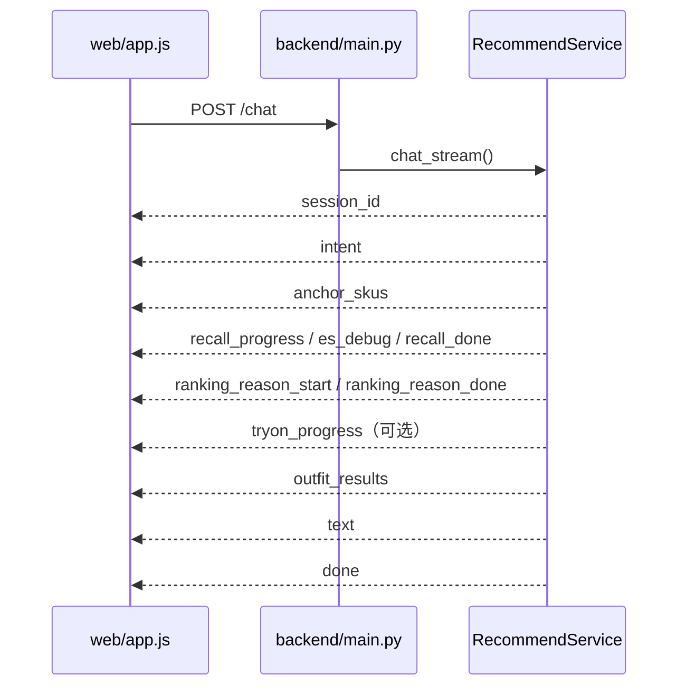

# FILA 穿搭推荐（`fila_agent_html`）

FILA 图文穿搭推荐服务的 **HTML 调试版**：单进程 FastAPI 提供推荐 API、SSE 对话、搭配预览与商品详情；运行时统一使用 ES（`skus` + `outfits`）并保留本地 JSON fallback。

***

## 1. 能力概览

| 能力       | 说明                                                                                  |
| -------- | ----------------------------------------------------------------------------------- |
| 图文对话推荐   | `POST /chat` SSE：意图解析 → 锚点 SKU → 多路搭配召回 → 排序/理由 → 可选试穿                              |
| 单品互补     | `POST /recommend/skus`：从锚点所在固定搭配中召回指定 `role` 单品                                     |
| 纯文本/图搭配  | `POST /recommend/outfits`：不经过完整对话编排的搭配召回                                            |
| 搭配预览     | `outfits-viewer/`：微导购固定搭配列表、单套详情、**商品详情页**                                          |
| 图片 Debug | `image-debug-viewer/`：SKU/SPU 的 `index_images` / `tryon_image` / `display_image` 选型 |
| 批量评测     | `eval/`：采样 SKU 跑全链路并人工打分                                                            |

设计原则（与线上一致）：

- 推荐结果来自 **已有固定搭配** 或 **向量拼套**，不自由生成库外货号。
- 粒度以 **`sku_id`（货号）** 为主，`spu_id`（款号）用于同款聚合。
- 检索：**Elasticsearch**（属性/文本）+ **Milvus**（图文向量、文本向量）。

***

## 2. 目录结构

```
fila_agent_html/
├── docs/                    # 字段与数据源说明（FILA搭配推荐使用字段.md）
├── backend/                 # FastAPI、召回、排序、意图、LLM/向量客户端
│   ├── main.py              # 路由与静态资源挂载
│   ├── services/            # recommend_service、outfit_recall、tryon
│   ├── retrieval/           # es_client、milvus_client、sku/outfit retriever
│   ├── intent/              # Trie/LLM 意图 + dictionaries/*.yaml
│   └── ranking/             # 规则分 / LLM 打分
├── web/                     # 推荐调试台（index.html / app.js）
├── outfits-viewer/          # 搭配预览 + detail.html 商品详情
├── image-debug-viewer/      # 图片选型 Debug（走 FastAPI 数据接口）
├── eval/                    # 批量评测与 review 页面
├── scripts/                 # 日更下载、processed ETL、预览 ETL、ES/Milvus 索引、规则提取
├── prompt/                  # LLM Prompt 模板（运行时加载，非用户文档）
├── data/
│   ├── tables/              # 商品 Hive 日更 CSV
│   ├── preview/             # fila_outfits.json（预览/规则提取）
│   ├── processed/           # skus.jsonl、spu_to_skus.json（fallback / 索引输入）
│   ├── logs/                # jsonl 日志、replay、etl/、索引同步状态
│   ├── reports/             # catalog/image 质量报告（ETL）
│   └── milvus_local/        # Milvus Lite 本地库（可选）
├── config.yaml              # 主配置（路径、模型、ES/Milvus、推荐开关）
└── requirements.txt
```

***

## 3. 环境准备

```bash
cd fila_agent_html
python3 -m venv .venv
source .venv/bin/activate   # Windows: .venv\Scripts\activate
pip3 install -r requirements.txt -i https://mirrors.aliyun.com/pypi/simple/
export PYTHONPATH="$(pwd)"
```

复制并按需填写密钥（勿提交仓库）：

```bash
cp .env.example .env
# 编辑后 source .env 或 export
```

| 变量                                      | 用途                                            |
| --------------------------------------- | --------------------------------------------- |
| `HIVE_USERNAME` / `HIVE_PASSWORD`       | `daily_download_product_tables.py`            |
| `ANTA_LLM_API_KEY`                      | 意图/视觉/排序/理由 LLM                               |
| `ARK_API_KEY`                           | Doubao 图文 embedding                           |
| `ES_HOSTS`                              | 覆盖 `config.yaml` 的 ES 地址（逗号分隔）                |
| `ES_USERNAME` / `ES_PASSWORD`           | ES 认证                                         |
| `FILA_MILVUS_MODE`                      | 覆盖 `milvus.mode`：`local`（默认）\| `cloud`        |
| `FILA_MILVUS_URI` / `FILA_MILVUS_TOKEN` | 最高优先级覆盖 URI / token                           |
| `FILA_MILVUS_PASSWORD`                  | cloud 模式密码（与 `milvus.cloud.username` 拼 token） |

**Milvus 连接模式**（`config.yaml` → `milvus.mode`，默认 `local`）：

| mode    | 说明                                                 |
| ------- | -------------------------------------------------- |
| `local` | Milvus Lite 本地库 `data/milvus_local/fila_milvus.db` |
| `cloud` | 阿里云托管 Milvus（`milvus.cloud.uri` + 环境变量密码）          |

切云端示例：

```bash
export FILA_MILVUS_MODE=cloud
export FILA_MILVUS_PASSWORD='your-password'
# 或在 config.yaml 设 milvus.mode: cloud
```

**Milvus Lite 注意**：`pymilvus` import 时会读 `MILVUS_URI`。若指向 `*.db` 可能报错。推荐：

```bash
unset MILVUS_URI
# 使用 config.yaml 的 milvus.local_data_file: data/milvus_local/fila_milvus.db
```

`backend/config.py` 会在 import 前暂存 `*.db` 路径；仍建议仅通过 `FILA_MILVUS_URI` 或配置文件指定本地库。

***

## 4. 数据与脚本

### 4.1 路径约定（`config.yaml` → `paths`）

| 路径                               | 内容                          |
| -------------------------------- | --------------------------- |
| `data/tables/`                   | 商品原始表 CSV（日更发布到此目录）         |
| `data/preview/fila_outfits.json` | 微导购搭配预览 JSON（viewer + 规则提取） |
| `data/processed/`                | 在线推荐用的 `*.jsonl` / `*.json` |

### 4.2 日更商品表（Hive → `data/tables/`）

```bash
export HIVE_USERNAME=...
export HIVE_PASSWORD=...
python3 scripts/daily_download_product_tables.py --env prod
```

常用表：`product_master`、`product_master_ext`、`product_attr`、`product_sku`、`product_image`、`product_image_type`、`search_index`、`product_guide_recommend`、`product_guide_recommend_ext`、`cc_material_product`。

快照目录：`data/tables/daily/YYYY-MM-DD/<table>/`；默认同时覆盖 `data/tables/<name>.csv`。

```bash
python3 scripts/daily_download_product_tables.py --list-tables   # 列出表
python3 scripts/daily_download_product_tables.py --tables product_sku --dry-run
```

### 4.3 统一搭配 JSON

```bash
# 默认读 data/tables/*.csv + data/tables/cc_material_product.csv
python3 scripts/build_fila_guide_outfits_fast.py --workers 64
```

可选脚本：

| 脚本                                      | 作用                                                                                       |
| --------------------------------------- | ---------------------------------------------------------------------------------------- |
| `build_fila_guide_outfits_fast.py`      | `cc_material_product.csv` + 商品表 → `data/preview/fila_outfits.json`，并作为 ES outfits 的唯一搭配源 |
| `build_fila_outfits.py`                 | 旧版官网 CSV/搭配模板 → 同 schema JSON（demo/join 模式）                                              |
| `fila_images_preprocess.py`             | VLM 选 tryon\_image + index\_images 数组 → `data/tables/fila_sku_selected_images.csv`           |
| `pull_cc_material_product.py`           | 可选：MySQL 单独拉取 `cc_material_product` → CSV（日更脚本已含该表）                                      |
| `extract_category_l2_pairing_rules.py`  | 从预览 JSON 归纳中类搭配规则 → `backend/intent/dictionaries/`                                       |
| `extract_color_series_pairing_rules.py` | 归纳色系搭配规则                                                                                 |
| `classify_color_series.py`              | SKU 颜色 → 色系（写回字典）                                                                        |

### 4.4 统一离线 ETL → ES

推荐、评测详情和 outfits-viewer 统一读 ES（`skus` + `outfits` 两索引），ES 不可用时 fallback 到本地 `skus.jsonl`、`spu_to_skus.json`、`data/preview/fila_outfits.json`。

```text
data/tables/*  (Hive 日更 CSV，见 §4.2)
    → build_catalog.py      → skus.jsonl, spu_to_skus.json
    → select_images.py      → 回写 skus.jsonl 图字段
    → build_fila_guide_outfits_fast.py → fila_outfits.json（读取 skus.jsonl 图字段）
    → validate_data.py
    → build_fila_es_index.py
    → POST /chat、/recommend/*
```

`compatibility_edges`、`outfits.jsonl`、`sku_to_outfits.json` 不再作为运行时数据源。单品互补改为从 anchor 所在 outfits 的 `items` 中提取同伴 SKU。

#### 与迪桑特（`descente_agent_html`）差异

| 项目               | descente                                   | FILA（本目录脚本）                                                                                                                                     |
| ---------------- | ------------------------------------------ | ----------------------------------------------------------------------------------------------------------------------------------------------- |
| 固定搭配源            | `wear_match.csv` + `wear_match_detail.csv` | `product_guide_recommend.csv` + `product_guide_recommend_ext.csv`                                                                               |
| `outfit_id`      | `wear_{id_match}`                          | `guide_{compose_id}`                                                                                                                            |
| `source`         | `wear_match`                               | `micro_guide`                                                                                                                                   |
| 目录 SKU 默认范围      | 搭配明细中的货号                                   | 微导购 ext 中有效搭配（`status=1`）的款号→货号                                                                                                                 |
| 扩 SKU（搭配引用）      | —                                          | 默认 `--supplement-from-outfits`：纳入 `cc_material_product`、`dphs_outfits.xlsx`、`outfits_unique.txt` 中 onsell 货号；`--no-supplement-from-outfits` 可关闭 |
| 文本检索字段           | `search_index.csv`                         | `search_title` / `keyword` 与主数据拼接（无 `search_index` 表时）                                                                                          |
| 中类 `category_l2` | `cat_alias`                                | 优先 `middle_class`，其次 `cat_alias`                                                                                                                |
| 角色 / 价格补强        | `product_master_ext.up_down`               | 同上 + 可选 `fila_products_brief_prod.xlsx`、`商品_斐乐v2.xlsx`                                                                                          |

#### 一键 / 分步执行

```bash
cd fila_agent_html
source .venv/bin/activate          # 或: source ../.venv/bin/activate
export PYTHONPATH="$(pwd)"

# 前置：§4.2 日更或自备完整 data/tables/*.csv
# 可选：先跑 VLM 选图（tryon + index_images），供 select_images 优先使用
# python3 scripts/fila_images_preprocess.py

python3 scripts/run_processed_etl.py

# 分步（与 run_processed_etl 顺序一致；build_catalog 默认补充搭配引用 SKU）：
python3 scripts/build_catalog.py
# 若不需要搭配扩品：python3 scripts/build_catalog.py --no-supplement-from-outfits
python3 scripts/select_images.py
python3 scripts/build_fila_guide_outfits_fast.py --workers 64
python3 scripts/build_fila_es_index.py --reset
python3 scripts/build_dphs_outfits_es.py 
python3 scripts/build_outfits_unique_es.py
python3 scripts/validate_data.py
```

| 脚本                                 | 产出 / 说明                                                                                                                                                                     |
| ---------------------------------- | --------------------------------------------------------------------------------------------------------------------------------------------------------------------------- |
| `etl_common.py`                    | 非入口；`ProductTables`、货号解析、`EtlLogger`                                                                                                                                        |
| `build_catalog.py`                 | `skus.jsonl`、`spu_to_skus.json`；**默认**从 `cc_material_product`、`dphs_outfits.xlsx`、`outfits_unique.txt` 补充搭配引用的 onsell SKU（不受 up\_time 过滤）；`--no-supplement-from-outfits` 关闭 |
| `build_fila_guide_outfits_fast.py` | `fila_outfits.json`；作为 viewer、召回和 ES outfits 的唯一搭配源                                                                                                                         |
| `select_images.py`                 | 回写 `display_image` / `index_images`（数组）/ `tryon_image`；优先 `data/tables/fila_sku_selected_images.csv`，否则 `product_image`                                                         |
| ~~`build_embeddings.py`~~          | 已废弃，功能由 `build_fila_milvus_multimodal_index.py` 替代                                                                                                                          |
| `run_processed_etl.py`             | 串联 catalog → select\_images → guide\_outfits\_fast → build\_fila\_es\_index；支持 `--from-step`                                                                                |

#### `data/processed/` 产物

| 文件                                              | 说明                                                                                  |
| ----------------------------------------------- | ----------------------------------------------------------------------------------- |
| `skus.jsonl`                                    | 单品（`sku_id`、`role`、`display_image`、`index_images`（数组）、`tryon_image`、`search_text`…） |
| `spu_to_skus.json`                              | 款号 → `[sku_id, …]`                                                                  |
| `taxonomy_gender.json`、`sku_text_vectors.jsonl` | 可选；由其它脚本或历史产物提供                                                                     |

#### 质量报告与 ETL 日志

| 路径                                       | 内容                                               |
| ---------------------------------------- | ------------------------------------------------ |
| `data/reports/catalog_quality_report.md` | 目录构建：SKU 数、role 未识别统计                            |
| `data/reports/image_quality_report.md`   | `index_images` / `tryon_image` 覆盖率               |
| `data/logs/etl/catalog_*.jsonl` 等        | 结构化事件（`catalog_load_started`、`outfits_summary`…） |

#### 校验与检索索引

```bash
python3 scripts/validate_data.py
```

需 ES / Milvus 可达且 `config.yaml` 中 `elasticsearch.enabled`、`milvus.enabled` 为 `true`：

```bash
python3 scripts/build_fila_es_index.py [--reset] [--incremental] [--prune-orphans]
python3 scripts/build_fila_milvus_multimodal_index.py [--reset] [--incremental]
python3 scripts/build_text_milvus_index.py
```

- **`--reset`（ES）**：删除并重建索引后全量灌库，见脚本头注释。
- 索引同步状态：`data/logs/fila_index_sync_state.json`（增量写入时使用）。

> **注意**：样本 `data/tables` 仅含少量微导购搭配时，ETL 产出的 SKU/搭配条数会远小于生产全量；联调请用 §4.2 生产日更表。重跑 ETL 会覆盖 `data/processed/`，必要时先用 git 备份。

***

## 5. 启动与页面

```bash
uvicorn backend.main:app --host 0.0.0.0 --port 8000
```

| 页面       | URL                                                             |
| -------- | --------------------------------------------------------------- |
| 穿搭推荐调试台  | <http://127.0.0.1:8000/>                                        |
| 搭配预览列表   | <http://127.0.0.1:8000/outfits-viewer/>                         |
| 单套搭配     | <http://127.0.0.1:8000/outfits-viewer/outfit.html?idMatch={id}> |
| 商品详情     | <http://127.0.0.1:8000/outfits-viewer/detail.html?sku={货号}>     |
| 图片 Debug | <http://127.0.0.1:8000/debug-static/index.html>                 |
| 批量评测     | <http://127.0.0.1:8000/eval/review.html>                        |
| 健康检查     | <http://127.0.0.1:8000/health>                                  |

调试台跳转 viewer 默认使用同源 `/outfits-viewer`；可覆盖：

```js
window.OUTFITS_VIEWER_BASE = 'http://其他主机/outfits-viewer'
```

本地开发也可单独起静态服务（仅预览、不跑 API）：

```bash
cd outfits-viewer && python3 -m http.server 8081
```

***

## 6. 推荐链路（实现）



### 6.1 意图与锚点

- 文本：`backend/intent`（默认 **Trie** 词典，`confidence` 不足时 **LLM fallback**）。
- 图片：上传图 embedding → Milvus 单品向量；高相似度可覆盖 `gender` / `season` / `anchor_role`（见 `config.intent`）。
- 显式锚点：`selected_sku_id` / `selected_spu_id` 优先于向量 Top1。

### 6.2 搭配多路召回（`config.recommend.recall_paths`）

| 开关             | 通路           | 说明                                              |
| -------------- | ------------ | ----------------------------------------------- |
| `image_vector` | 相似固定搭配       | 图向量近邻 SKU → 查固定搭配库                              |
| `query2es`     | ES 按 role 检索 | 属性 + 文本拼套（`category_l2` / `color_series` 规则可过滤） |
| `text_vector`  | 文本向量 Milvus  | 语义拼套                                            |

合并去重 → **规则分或 LLM 分** 排序（`ranking_scoring_method`、`enable_llm_rank_reason`）→ 生成 `outfit_results` 卡片。

### 6.3 虚拟试穿

`config.recommend.tryon.enabled` 默认 `false`；调试台可通过请求体 `enable_tryon` 打开。固定搭配已有穿搭图时默认不替换（`replace_existing_image`）。

***

## 7. HTTP API

### 7.1 `POST /chat`（SSE）

**请求** `Content-Type: application/json`：

```json
{
  "session_id": "可选，多轮会话",
  "message": "这件浅灰 T 恤怎么搭？",
  "image_base64": "纯 Base64，不含 data:image 前缀",
  "selected_sku_id": "F11W629122FMG",
  "selected_spu_id": null,
  "ranking_scoring_method": "rule",
  "enable_llm_rank_reason": true,
  "skip_reason": false,
  "llm_model": "qwen3.5-flash",
  "enable_tryon": false
}
```

至少提供 `message`、`image_base64`、`selected_sku_id` 之一。

**SSE 事件**（每条含 `elapsed_ms`）：

| type                                           | 含义                       |
| ---------------------------------------------- | ------------------------ |
| `session_id`                                   | 会话 ID                    |
| `intent`                                       | 解析后的意图槽位                 |
| `anchor_skus`                                  | 锚点候选（含相似度）               |
| `recall_progress`                              | 某路召回完成                   |
| `es_debug`                                     | Query2ES 各 role 的 ES 查询体 |
| `recall_done`                                  | 去重前后数量                   |
| `ranking_reason_start` / `ranking_reason_done` | 排序与理由阶段                  |
| `tryon_progress`                               | 试穿进度（启用时）                |
| `outfit_results`                               | 搭配卡片列表                   |
| `text`                                         | 总结文案                     |
| `done`                                         | 结束，`total_ms`            |

**最终业务字段**（流结束后聚合）：

```json
{
  "session_id": "...",
  "outfits": [
    {
      "outfit_id": "guide_1233439055010869248",
      "id_match": "1233439055010869248",
      "name": "导购搭配 ...",
      "recall_source": "anchor_graph",
      "is_synthetic": false,
      "display_image": "http://...",
      "index_images": ["http://..."],
      "price_total": 1260.0,
      "quality_score": 0.405,
      "reason": "这套搭配...",
      "items": [
        {
          "sku_id": "A11W623339FWT",
          "spu_id": "A11W623339F",
          "role": "bottoms",
          "title": "...",
          "price": 680.0,
          "display_image": "https://...",
          "tryon_image": "https://...",
          "is_master": false,
          "is_anchor": true,
          "reason": ""
        }
      ],
      "source_outfit_ids": ["guide_..."]
    }
  ],
  "summary": "总体推荐理由..."
}
```

`outfit_id` 为 `guide_*` 时，预览页 `idMatch` 可取后缀数字。

### 7.2 `POST /recommend/skus`

该接口不再依赖 compatibility edges，而是从 anchor 所在固定搭配中提取指定角色的同伴 SKU。

```json
{
  "anchor_sku_id": "A11W621125FGY",
  "anchor_spu_id": "A11W621125F",
  "target_roles": ["bottoms", "shoes"],
  "filters": { "gender": "女", "season": ["夏季"], "budget_max": 2000 },
  "limit_per_role": 6
}
```

### 7.3 `POST /recommend/outfits`

```json
{
  "query": "女生夏季健身穿搭",
  "image_base64": null,
  "filters": { "gender": "女", "occasion_tags": ["健身"] },
  "limit": 6
}
```

### 7.4 查询接口

- `GET /skus/{sku_id}`
- `GET /spus/{spu_id}/skus`
- `GET /outfits/{outfit_id}`
- `GET /api/outfits?offset=0&size=80`
- `POST /api/outfits/mget`
- `GET /api/ui-config` — 调试台展示开关
- `GET /debug/images?sku_id=` / `?spu_id=` — image-debug JSON

***

## 8. 配置要点（`config.yaml`）

| 区块              | 说明                                                                         |
| --------------- | -------------------------------------------------------------------------- |
| `paths`         | `product_dir`、`processed_dir`、`logs_dir`                                   |
| `intent`        | Trie/LLM、图搜覆盖阈值、`category_l2` / `color_series` 字典目录                        |
| `models.*`      | 各阶段 LLM；`api_key_env` 指向环境变量                                               |
| `embedding`     | Ark 图文向量模型与维度                                                              |
| `elasticsearch` | `umalog-q-maiamgs-index-fila-skus` / `umalog-q-maiamgs-index-fila-outfits` |
| `milvus`        | `mode` local/cloud；集合 `fila_sku_vectors`、`fila_sku_text_vectors`           |
| `recommend`     | 召回开关、排序方式、试穿、默认条数、日志 redact                                                |

本地覆盖可复制 `config-local.yaml`（若代码支持加载）或只改 `config.yaml`。

***

## 9. 日志与调试

- 终端：`[FILA穿搭管线]` 阶段日志（`debug_recommend_pipeline`）。
- 文件：`data/logs/online/*.jsonl`、`data/logs/replay/{session}.json`。
- 调试台底部 **SSE 事件日志** 可展开每步 JSON。

环境变量（优先于 yaml）：

| 变量                                                     | 作用                 |
| ------------------------------------------------------ | ------------------ |
| `FILA_AGENT_DEBUG_PIPELINE` / `FILA_V2_DEBUG_PIPELINE` | 管线阶段详细日志           |
| `FILA_AGENT_DEBUG_API_IO` / `FILA_V2_DEBUG_API_IO`     | HTTP/SSE/LLM IO 摘要 |

批量评测：

```bash
python3 -m eval.batch_eval --workers 1 --limit 3
# 结果默认 eval/results/，在 /eval/review.html 打分, workers=1用于生成试穿图
```

`eval.batch_eval` 会把每次批量评测推荐出的搭配写入 ES `outfits` 索引，供评测详情页通过 `/api/outfits/mget` 展示完整搭配数据。评测写入的文档会使用独立 `outfit_id`，并保留 `original_outfit_id`；`source` 为 `batch_eval_<recall_source>`，例如 `batch_eval_query2es_compose`。线上/调试推荐 pipeline 的固定搭配召回默认只读取运营 source（`cc_material`、`micro_guide`），不会召回这些 `batch_eval_*` 文档。

批量评测搭配 ES 写入 / 删除工具：

```bash
# 预估将删除多少 batch_eval_* 搭配
python3 -m eval.batch_eval_outfit_es delete --dry-run

# 删除全部 batch_eval_* 搭配（不会删除运营固定搭配）
python3 -m eval.batch_eval_outfit_es delete --yes

# 只删除某个批量评测 source
python3 -m eval.batch_eval_outfit_es delete --source batch_eval_query2es_compose --yes

# 只删除某个输入 SKU 产生的批量评测搭配
python3 -m eval.batch_eval_outfit_es delete --input-sku-id SKU_ID --yes

# 从评测结果文件重新写入 ES（文件路径相对 fila_agent_html）
python3 -m eval.batch_eval_outfit_es index-results eval/results/top__polo.json
```

***

## 10. 字段与数据源说明

商品表、processed 模型、API 字段映射见 **[docs/FILA搭配推荐使用字段.md](docs/FILA搭配推荐使用字段.md)**。

原 `fila/` 目录已移除；数据与脚本均在本仓库 `fila_agent_html/` 下维护。

***

## 11. 文档说明

原根目录说明已合并入本 README：

- ~~`实现方案.md`~~ → 第 5～6 节（部署与前端 SSE）
- ~~`FILA穿搭推荐入参出参.md`~~ → 第 7.1 节
- ~~`技术方案.md`~~ → 第 1、4、6 节及索引脚本说明；**离线 ETL 脚本**已落地为 `scripts/build_catalog.py` 等（§4.4），不再仅依赖迪桑特目录拷贝
- ~~`model/outfit-transformer/DEPLOY.md`~~、~~`model/outfit-transformer/RETRIEVAL.md`~~ → 第 12 节（Outfit Transformer 模型服务）

`prompt/*.md` 为 LLM 模板，由 `config.prompt_files` 引用，不作为用户手册维护。

***

## 12. Outfit Transformer 模型服务

基于 Fashion-CLIP + Transformer 的搭配模型服务（独立部署于 `model/outfit-transformer/`），为 `fila_agent_html` 提供 **搭配兼容性打分** 与 **互补单品检索** 两类能力。服务内置 `Helsinki-NLP/opus-mt-zh-en` 中译英模型，描述字段可直接传中文。

### 12.1 能力概览

| 能力      | 端点                                        | 模型 Checkpoint                  | 用途                   |
| ------- | ----------------------------------------- | ------------------------------ | -------------------- |
| 搭配兼容性打分 | `POST /score`                             | `compatibillity_clip_best.pth` | 评估一组单品的搭配协调度（0\~1 分） |
| 互补单品检索  | `POST /embed_query` / `POST /embed_items` | `complementary_clip_best.pth`  | 给定已有搭配，检索风格互补的新单品    |

两个 checkpoint 对应不同训练任务，服务启动时分别加载为 `_model`（兼容性）和 `_complementary_model`（互补检索）。若 `complementary_checkpoint` 未配置，`/embed_query`、`/embed_items` 会回退使用兼容性模型（日志输出 WARNING）。

### 12.2 环境与模型准备

- Python 3.12+
- CUDA 12.1+（GPU 推理）或 CPU
- 依赖：`torch`、`transformers`、`fastapi`、`uvicorn`、`httpx`、`pillow`、`pydantic`

| 模型                             | 用途                 | 默认来源            |
| ------------------------------ | ------------------ | --------------- |
| `patrickjohncyh/fashion-clip`  | CLIP 图文编码器（frozen） | HuggingFace Hub |
| `Helsinki-NLP/opus-mt-zh-en`   | 中文→英文翻译            | HuggingFace Hub |
| `compatibillity_clip_best.pth` | 兼容性打分权重            | 训练产出 / gdown 下载 |
| `complementary_clip_best.pth`  | 互补检索权重             | 训练产出            |

权重下载示例：

```bash
pip install gdown
gdown 1mzNqGBmd8UjVJjKwVa5GdGYHKutZKSSi -O src/checkpoints/model.pth
```

服务器无法访问 HuggingFace 时，需提前下载到本地并在 `config.yaml` 中配置路径。

### 12.3 配置与启动

编辑 `model/outfit-transformer/config.yaml`：

```yaml
models:
  fashion_clip: /path/to/fashion-clip          # 本地路径或 HuggingFace repo id
  translation_zh_en: /path/to/opus-mt-zh-en    # 本地路径或 HuggingFace repo id

serve:
  compatibillity_checkpoint: /path/to/compatibillity_clip_best.pth   # 兼容性打分模型
  complementary_checkpoint: /path/to/complementary_clip_best.pth     # 互补检索模型
  model_type: clip                 # clip | original
  device: cuda                     # cuda | cpu
  host: 0.0.0.0
  port: 8080
```

环境变量覆盖（优先级：环境变量 > config.yaml > 默认值）：

| 环境变量                             | 对应配置                              | 默认值                          |
| -------------------------------- | --------------------------------- | ---------------------------- |
| `COMPATIBILLITY_CHECKPOINT_PATH` | `serve.compatibillity_checkpoint` | `""`                         |
| `COMPLEMENTARY_CHECKPOINT_PATH`  | `serve.complementary_checkpoint`  | `""`                         |
| `MODEL_TYPE`                     | `serve.model_type`                | `clip`                       |
| `DEVICE`                         | `serve.device`                    | `cuda`                       |
| `HOST`                           | `serve.host`                      | `0.0.0.0`                    |
| `PORT`                           | `serve.port`                      | `8080`                       |
| `TRANSLATION_MODEL`              | `models.translation_zh_en`        | `Helsinki-NLP/opus-mt-zh-en` |

启动服务：

```bash
cd model/outfit-transformer
python -m src.serve.app
# 或：COMPATIBILLITY_CHECKPOINT_PATH=/path/to.pth DEVICE=cuda python -m src.serve.app
```

正常启动日志应包含：

```
INFO:src.serve.app:Outfit model loaded on cuda
INFO:src.serve.app:Loading complementary model: type=clip checkpoint=/path/to/complementary_clip_best.pth
INFO:src.serve.app:Complementary model loaded on cuda
```

健康检查：

```bash
curl http://localhost:8080/health
# {"status":"ok"}
```

### 12.4 API 接口

#### POST /score

评估一组单品的搭配兼容性，支持批量请求。

**请求体**（`description` 传中文，服务端自动翻译）：

```json
{
  "outfits": [
    {
      "outfit_id": "outfit_001",
      "items": [
        {"image_url": "https://example.com/tshirt.jpg", "description": "黑色纯棉圆领短袖T恤"},
        {"image_url": "https://example.com/pants.jpg", "description": "深蓝色直筒牛仔裤"}
      ]
    }
  ]
}
```

**响应体**：

```json
{
  "scores": [
    {"outfit_id": "outfit_001", "score": 0.8523}
  ]
}
```

`score` 为 0\~1 的兼容性分数，越高表示搭配越协调。

#### POST /embed\_query

给定当前搭配中的若干单品，生成 **128 维互补查询向量**，用于在向量数据库中检索风格互补的候选单品。

**请求体**：

```json
{
  "items": [
    {"image_url": "https://example.com/top.jpg", "description": "白色运动T恤"},
    {"image_url": "https://example.com/pants.jpg", "description": "黑色运动长裤"}
  ]
}
```

**响应体**：

```json
{"embedding": [0.0312, -0.1547, 0.0891, "... (128 维)"]}
```

- `items` 可传 1\~N 个单品，模型将它们视为已有搭配上下文
- 返回向量表示"与这组搭配互补的理想单品"的语义

#### POST /embed\_items

为一组单品分别生成 **128 维嵌入向量**，用于离线建索引（写入 Milvus 等向量库）。每个单品独立编码，`embeddings` 与 `items` 一一对应，建议 batch size 16\~32。

**请求体**：

```json
{
  "items": [
    {"image_url": "https://example.com/item1.jpg", "description": "红色羽绒马甲"},
    {"image_url": "https://example.com/item2.jpg", "description": "灰色针织围巾"}
  ]
}
```

**响应体**：

```json
{
  "embeddings": [
    [0.0421, -0.0983, "... (128 维)"],
    [0.0156, 0.1234, "... (128 维)"]
  ]
}
```

### 12.5 接入 fila\_agent\_html

#### 粗排模型打分

编辑 `fila_agent_html/config.yaml`，将粗排方式切换为模型打分：

```yaml
recommend:
  coarse_ranking_method: "model"    # rule（默认）| model
  outfit_model_score:
    service_url: "http://localhost:8080"
    timeout: 5                      # 请求超时（秒）
```

模型服务不可用时自动 fallback 到规则打分，不影响线上稳定性。

#### 互补模型召回

在 `fila_agent_html/config.yaml` 中开启互补召回通路：

```yaml
recommend:
  recall_paths:
    image_vector: true
    text_vector: true
    query2es: true
    complementary_model: true       # 开启互补模型召回

  complementary_model:
    service_url: "http://10.213.148.68:32465"
    timeout: 5                      # embed_query 超时（秒）
    top_k: 20                       # Milvus 返回候选数

milvus:
  collections:
    sku_complementary_vectors: "fila_sku_complementary_vectors"
```

设置 `complementary_model: false` 或不配置 `service_url` 即可关闭此通路。互补模型召回是四路并行召回之一，`/embed_query` 超时或报错时该路返回空结果，其他三路正常工作。

### 12.6 端到端检索流程

```
                  ┌─────────────────────────────────┐
                  │   outfit-transformer serve (GPU) │
                  │                                   │
                  │  /embed_query  → 128 维查询向量    │
                  │  /embed_items  → 128 维单品向量    │
                  │  /score        → 兼容性分数        │
                  └────────┬──────────────┬───────────┘
                           │              │
                  在线检索   │     离线建索引 │
                           ▼              ▼
                  ┌─────────────────────────────────┐
                  │         Milvus 向量数据库         │
                  │  collection:                      │
                  │  fila_sku_complementary_vectors    │
                  │  (sku_id, complementary_vector,    │
                  │   spu_id, role, category_l2,       │
                  │   gender, season)                  │
                  └─────────────────────────────────┘
```

#### Step 1: 离线建索引

使用 `scripts/build_complementary_vectors.py`，遍历 `data/processed/skus.jsonl` 中所有 SKU，调用 `/embed_items` 生成向量写入 Milvus。

```bash
cd fila_agent_html
source .venv/bin/activate
export PYTHONPATH="$(pwd)"

python3 scripts/build_complementary_vectors.py \
    --serve-url http://10.213.148.68:31861 \
    --batch-size 16 \
    --reset          # 首次建索引或重建时加 --reset
```

| 参数               | 说明                          | 默认值   |
| ---------------- | --------------------------- | ----- |
| `--serve-url`    | outfit-transformer 服务地址（必填） | -     |
| `--batch-size`   | 每批送入 `/embed_items` 的 SKU 数 | 16    |
| `--reset`        | 删除并重建 Milvus collection     | 不删除   |
| `--test-limit N` | 只处理前 N 个 SKU（调试用）           | 0（全量） |
| `--timeout`      | 每批 HTTP 超时（秒）               | 60    |

**Milvus collection schema**（`fila_sku_complementary_vectors`）：

| 字段                     | 类型                 | 说明             |
| ---------------------- | ------------------ | -------------- |
| `sku_id`               | VARCHAR(64), PK    | SKU 唯一标识       |
| `complementary_vector` | FLOAT\_VECTOR(128) | 互补嵌入向量         |
| `spu_id`               | VARCHAR(32)        | SPU ID         |
| `role`                 | VARCHAR(32)        | 角色（上装/下装/鞋/配件） |
| `category_l2`          | VARCHAR(64)        | 二级品类           |
| `gender`               | VARCHAR(32)        | 性别             |
| `season`               | VARCHAR(256)       | 季节             |

#### Step 2: 在线检索

开启 `complementary_model: true` 后，推荐链路自动执行：

1. 从用户意图中确定 anchor SKU（锚定单品）
2. 以 anchor 的图片 + 描述调用 `/embed_query`，得到 128 维查询向量
3. 在 Milvus `fila_sku_complementary_vectors` 中搜索 top\_k 近邻
4. 按 gender、season、category\_l2 过滤
5. 按 role 分组，拼装为候选搭配
6. 与其他三路召回（image\_vector / text\_vector / query2es）的结果合并排序

### 12.7 生产部署建议

**Docker**：

```dockerfile
FROM pytorch/pytorch:2.5.0-cuda12.1-cudnn9-runtime

WORKDIR /app
COPY model/outfit-transformer /app

RUN pip install fastapi uvicorn httpx transformers pillow pyyaml

EXPOSE 8080
CMD ["python", "-m", "src.serve.app"]
```

**GPU 资源**：

- 加载两个模型（兼容性 + 互补）约 4\~5 GB 显存；仅加载兼容性模型约 2\~3 GB
- 建议单独部署，避免与训练任务抢占 GPU
- CPU 模式可用但推理速度较慢，设置 `device: cpu`

**性能参考**：

- 单次 `/score` 请求（1 套搭配 3 件单品）：\~200ms（GPU）/ \~2s（CPU）
- 图片下载为主要耗时瓶颈，内置 LRU 缓存可复用已下载图片

