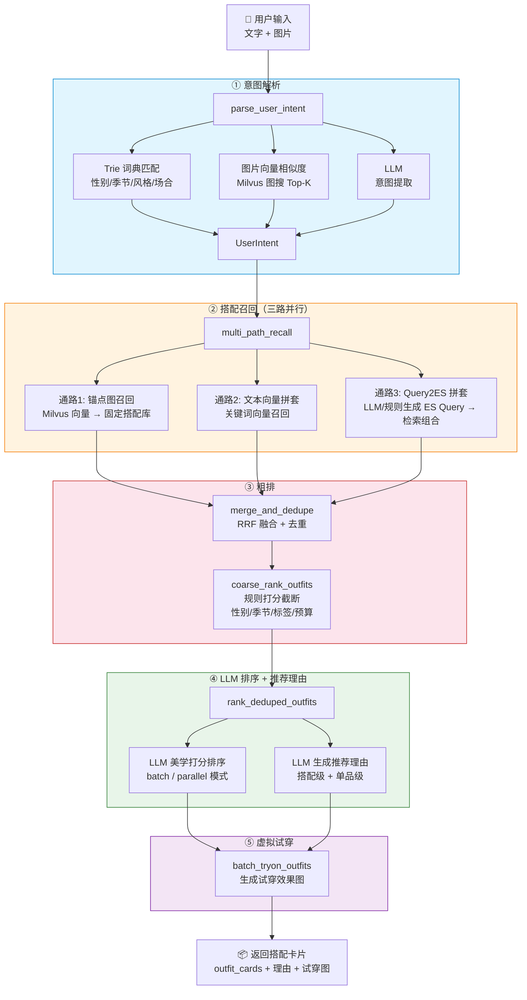
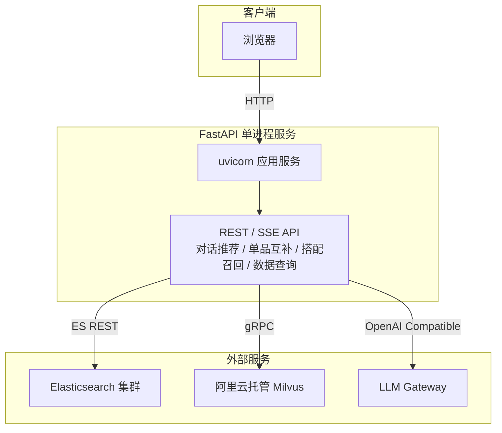
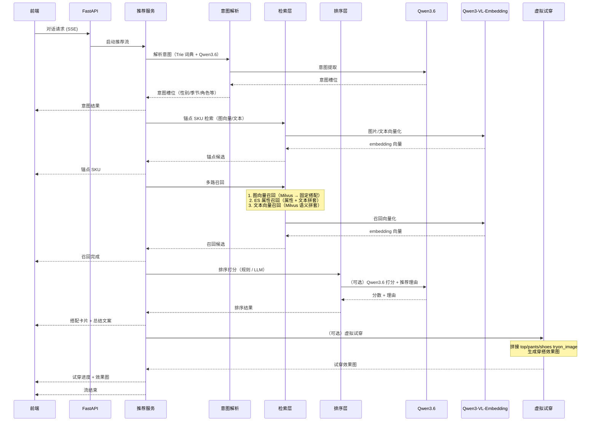
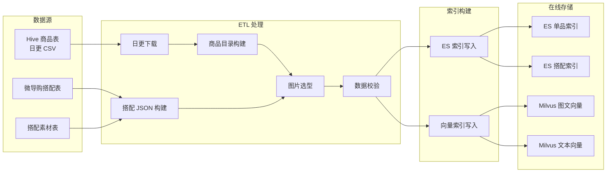

# FILA 穿搭推荐系统架构

## 1. 系统概述

FILA 穿搭推荐系统是一个**品牌隔离**的图文穿搭推荐服务，采用 FastAPI 架构，提供推荐 API、SSE 对话、搭配预览与商品详情功能。系统基于已有固定搭配和向量匹配和文本匹配拼套进行推荐。

---

## 2. 架构图

### 2.1 推荐流程

### 2.2 架构流程图

## 3. 部署架构图

---

## 4. 推荐管线流程

## 5. 数据索引与存储位置

### 5.1 Elasticsearch 索引

| 索引 | 用途 | 存储内容 |
| --- | --- | --- |
| **fila-skus** | SKU 单品索引 | 商品属性、搜索文本、图片 URL、价格、中类、色系等 |
| **fila-outfits** | 搭配索引 | 固定搭配组合（搭配 ID、商品列表、来源标记） |

*   部署在内网 ES 集群（ES 7.9.3），通过环境变量配置连接与认证
    
*   支持全量重建和增量更新
    

### 5.2 Milvus 向量索引

| Collection | 用途 | 向量维度 | 距离度量 |
| --- | --- | --- | --- |
| **fila**_sku_vectors | SKU 图文向量 | 1024 | COSINE |
| **fila**_sku_text\_vectors | SKU 文本向量 | 1024 | COSINE |

*   **云端模式**（生产环境）：阿里云托管 Milvus，HNSW 索引
    
*   **本地模式**（开发调试）：Milvus Lite 本地文件，IVF\_FLAT 索引
    

### 5.3 本地文件存储

| 目录 | 说明 |
| --- | --- |
| `data/tables/` | Hive 日更商品原始表 CSV |
| `data/processed/` | 离线 ETL 产出的单品目录与款号映射 |
| `data/preview/` | 微导购固定搭配预览 JSON |
| `data/logs/` | 索引同步状态、在线推荐日志、会话回放 |

### 5.4 数据流向

---

## 5. 核心模块说明

### 5.1 后端模块

| 模块 | 职责 |
| --- | --- |
| **应用入口** | FastAPI 路由、静态资源挂载、SSE 流 |
| **配置管理** | 配置加载（yaml + 环境变量覆盖） |
| **推荐服务** | 推荐全链路编排（意图 → 召回 → 排序 → 理由） |
| **意图解析** | Trie 词典意图解析 + LLM fallback |
| **ES 检索** | Elasticsearch 查询封装 |
| **Milvus 检索** | 向量检索（cloud / local 双模式） |
| **搭配召回** | 固定搭配召回 + 向量拼套 |
| **单品检索** | 单品查询与互补召回 |
| **排序打分** | 规则打分 / LLM 打分排序 |
| **卡片构建** | 搭配结果卡片组装 |
| **虚拟试穿** | 试穿图片生成服务 |
| **LLM 客户端** | OpenAI Compatible LLM 调用封装 |
| **Embedding 客户端** | 图文向量生成 |

---

## 6. ETL 与日更流程

数据日更流程依次执行以下步骤：

1.  **日更下载** — 从 Hive 拉取最新商品表 CSV
    
2.  **商品目录构建** — 清洗生成单品目录与款号映射
    
3.  **搭配 JSON 构建** — 从微导购搭配表构建统一搭配数据
    
4.  **图片选型** — 为每个 SKU 选定展示图、索引图、试穿图
    
5.  **数据校验** — 检查数据完整性
    
6.  **ES 索引写入** — 写入 ES 单品索引和搭配索引（支持增量）
    
7.  **向量索引写入** — 写入 Milvus 图文向量和文本向量（支持增量）
    

增量索引同步状态由专用脚本管理，确保日更时仅写入变更数据。