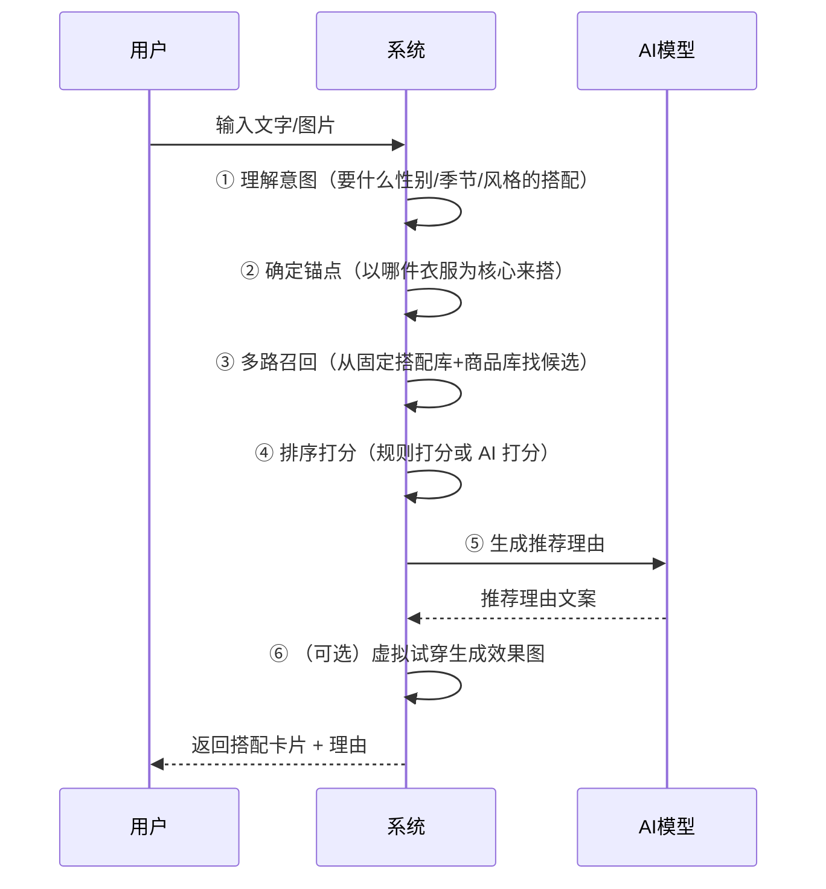

# FILA 穿搭推荐系统 · 产品方案文档

> **读者对象**：零 Python 基础的开发工程师（下一版本开发人员）
> **文档目的**：讲清楚这个系统"是什么、给谁用、能做什么、业务规则是什么"，不涉及代码细节（代码细节见《技术架构文档》）
> **阅读建议**：从头到尾读一遍约 20 分钟；重点看第 2、4、5 章

---

## 目录

1. [产品概述](#1-产品概述)
2. [目标用户与使用场景](#2-目标用户与使用场景)
3. [核心功能清单](#3-核心功能清单)
4. [产品使用流程](#4-产品使用流程)
5. [业务规则与推荐逻辑](#5-业务规则与推荐逻辑)
6. [内容与数据](#6-内容与数据)
7. [对外接口能力](#7-对外接口能力)
8. [质量保障与评测](#8-质量保障与评测)
9. [下一版本产品规划建议](#9-下一版本产品规划建议)

---

## 1. 产品概述

### 1.1 这是什么产品？

FILA 穿搭推荐系统是一个 **AI 穿搭推荐服务**：用户输入一句话（如"这件浅灰 T 恤怎么搭？"）或上传一张衣服图片，系统就能推荐出 **一整套搭配**（上装 + 下装 + 鞋 + 配饰），并给出推荐理由。

它同时提供：

- **对话式推荐**（像聊天一样，一步步告诉你推荐结果）
- **单品互补**（给你一件衣服，推荐能搭配的其他单品）
- **搭配预览**（查看运营配置好的固定搭配）
- **批量评测**（自动测试推荐质量并人工打分）

### 1.2 它解决什么问题？

| 用户痛点 | 系统解法 |
|---------|---------|
| 不知道买回来的衣服怎么搭 | 输入单品 → 推荐完整搭配 |
| 不知道买什么 | 说一句需求（"女生夏季健身穿搭"）→ 推荐成套方案 |
| 搭配不协调、不专业 | 用「固定搭配库 + 搭配规则 + AI 打分」保证搭配合理性 |
| 导购推荐效率低 | 用 AI 自动生成推荐，导购可复用 |

### 1.3 核心设计原则（重要！）

这是理解整个系统的钥匙，也是下一版本必须遵守的底线：

1. **不凭空造货**：推荐结果必须来自 **已有固定搭配** 或 **从商品库中拼套**，绝不生成商品库中不存在的货号。
2. **以货号（sku_id）为最小单位**：每个推荐单品都是一个真实货号；款号（spu_id）用于把同款不同颜色聚合。
3. **两条检索通道**：
   - **Elasticsearch（ES）**：按商品属性、文本关键词检索（"找白色运动鞋"）
   - **Milvus（向量库）**：按图片相似度、语义相似度检索（"找和这张图风格像的"）
4. **搭配合理性靠三层保障**：运营固定搭配 → 中类/色系搭配规则 → AI 打分排序。

---

## 2. 目标用户与使用场景

### 2.1 使用者

| 角色 | 说明 |
|------|------|
| **终端消费者** | 通过导购小程序（micro_guide）或微信小程序（wechat_mini）使用推荐能力 |
| **导购员** | 在导购场景帮顾客推荐穿搭 |
| **运营人员** | 配置固定搭配、查看评测结果 |
| **开发/测试人员** | 使用调试台、批量评测工具验证系统 |

### 2.2 典型使用场景

**场景 A：图文对话推荐（核心）**
> 用户在聊天框输入"这件浅灰 T 恤怎么搭？"，并上传 T 恤照片。
> 系统返回：3~6 套搭配，每套含上装/下装/鞋等单品、图片、价格、推荐理由。

**场景 B：单品互补推荐**
> 导购选中一件上衣，系统返回能搭配的裤子和鞋各若干件。

**场景 C：纯需求推荐**
> 用户只说"女生夏季健身穿搭"，不传图。系统解析意图后直接推荐成套方案。

**场景 D：运营搭配预览**
> 运营在网页上浏览微导购配置好的固定搭配，查看单品详情。

**场景 E：批量评测**
> 测试人员采样一批商品，跑全链路推荐，逐条人工打分，发现 badcase。

---

## 3. 核心功能清单

| # | 功能 | 入口 | 说明 |
|---|------|------|------|
| 1 | **图文对话推荐** | `POST /chat`（SSE 流式） | 意图解析 → 锚点 → 多路召回 → 排序/理由 → 可选试穿 |
| 2 | **单品互补** | `POST /recommend/skus` | 从锚点所在固定搭配中召回指定角色（如裤子/鞋）单品 |
| 3 | **纯文本/图搭配** | `POST /recommend/outfits` | 不经过完整对话编排的搭配召回 |
| 4 | **搭配预览** | `outfits-viewer/` 页面 | 固定搭配列表、单套详情、商品详情页 |
| 5 | **图片 Debug** | `image-debug-viewer/` 页面 | 查看每个 SKU/SPU 的图片选型 |
| 6 | **批量评测** | `eval/` 页面 | 采样 SKU 跑全链路并人工打分 |
| 7 | **对外 B2B 接口** | `POST /v1/outfit/recommend` | 面向小程序等外部调用方，含鉴权与限流 |
| 8 | **请求审计** | `GET /api/audit/requests` | 记录对外请求的输入/意图/召回/结果，便于问题定位 |
| 9 | **健康检查** | `GET /health` | 服务存活探针 |

---

## 4. 产品使用流程

### 4.1 对话推荐完整流程（用户视角）



### 4.2 用户看到什么（返回的搭配卡片）

每一套搭配包含：

- **outfit_id**：搭配唯一编号（`guide_` 开头是运营固定搭配，`synth_` 开头是系统拼出来的）
- **单品列表 items**：每件含货号、款号、角色（上装/下装/鞋…）、标题、价格、图片、是否锚点
- **display_image / index_images**：搭配展示图
- **price_total**：整套总价
- **quality_score**：搭配质量分
- **reason**：推荐理由文案
- **recall_source**：这套搭配来自哪条召回通路（相似固定搭配 / 文本向量 / Query2ES / 互补模型）

### 4.3 流式返回（SSE）

对话推荐不是一次性返回，而是**逐步推送**进度事件，前端可以实时展示"正在理解您的话…正在找搭配…正在生成理由…"。事件类型包括：

`session_id`（会话号）→ `intent`（解析出的意图）→ `anchor_skus`（锚点候选）→ `recall_progress`（各通路召回进度）→ `recall_done`（召回完成）→ `ranking_reason_start/done`（排序理由）→ `tryon_progress`（试穿进度）→ `outfit_results`（搭配结果）→ `text`（总结文案）→ `done`（结束）

---

## 5. 业务规则与推荐逻辑

> 这一章是"业务大脑"，下一版本改推荐效果主要改这里。所有规则都有对应代码文件，详见技术文档第 6 章。

### 5.1 意图解析（理解用户要什么）

系统把用户的话/图解析成一组**槽位（slot）**：

| 槽位 | 含义 | 例子 |
|------|------|------|
| gender | 性别 | 男 / 女 / 男童 / 女童 / 儿童 |
| age | 童装年龄段 | 小童 / 中大童 / 婴幼童 / 通码 |
| season | 季节 | 春 / 夏 / 秋 / 冬 |
| anchor_role | 锚点角色 | 上装 / 下装 / 鞋 |
| target_roles | 目标搭配角色 | [上装, 下装, 鞋] |
| occasion_tags | 场合 | 健身 / 通勤 / 运动 |
| style_tags | 风格 | 休闲 / 运动 / 简约 |
| color / color_series | 颜色 / 色系 | 白 / 浅色系 |
| category | 品类 | T恤 / 卫衣 / 牛仔裤 |
| length_class | 长度类型 | 长袖 / 短袖 / 长裤 / 短裤 |
| modeling | 版型 | 宽松 / 修身 |
| budget_max / budget_min | 预算 | 不超过 2000 元 |
| series | 子品牌线 | ORIGINALE / GOLF / FILA FUSION |

**解析方式（三路融合）**：
1. **词典匹配**：用预置词典（Trie）快速识别常见词（"男士"→男、"夏季"→夏）
2. **图片理解**：上传图片 → 向量检索 → 相似商品属性反推（高相似度时覆盖性别/季节/角色）
3. **AI 大模型**：词典没把握时，让大模型从文字中提取槽位

**关键规则**：用户**明确说了**的（如"女士"）优先级最高，图片和 AI 都不能覆盖。

### 5.2 锚点确定（以哪件为核心）

优先级从高到低：
1. 用户**显式选择**的货号（selected_sku_id）
2. 用户**上传图片**的向量近邻 Top1
3. 文本中提到的**货号 token**
4. 都没有 → 无锚点，纯靠需求词推荐

### 5.3 多路召回（找候选搭配）

系统并行跑 **4 条通路**找候选，然后合并去重：

| 通路 | 原理 | 适用场景 |
|------|------|---------|
| **相似固定搭配**（image_vector） | 用锚点图片向量在 Milvus 找相似商品 → 查这些商品所在的固定搭配 | 用户传图时 |
| **Query2ES 拼套**（query2es） | 把意图转成 ES 查询，按角色分别检索单品 → 拼成一套 | 有明确需求词时 |
| **文本向量拼套**（text_vector） | 用语义向量在 Milvus 找相似单品 → 拼套 | 语义匹配 |
| **互补模型**（complementary_model） | 用专门的搭配模型找"风格互补"单品 | 追求搭配协调度 |

**搭配规则过滤**（保证搭配合理）：
- **中类搭配规则**：哪些中类能搭（如"长袖上装"不能配"短裤"）
- **色系搭配规则**：哪些色系能搭（如"浅色上装"配"浅色下装"）
- **场景域过滤**：日常服 × 专业运动服不互搭
- **上架时间过滤**：默认只召回 180 天内上架的商品

### 5.4 排序打分（哪个搭配排前面）

**粗排（规则打分）**：给每套搭配算一个总分，分项包括：

| 分项 | 权重 | 含义 |
|------|------|------|
| source_match | 0.30 | 是否来自图召回匹配 |
| intent_match | 0.15 | 是否匹配用户意图 |
| completeness | 0.11 | 搭配完整度（上装+下装+鞋最完整） |
| category_l2_match | 0.15 | 中类是否匹配 |
| tryon_coverage | 0.09 | 试穿图覆盖率 |
| color_harmony | 0.10 | 色系是否和谐 |
| price_match | 0.05 | 是否在预算内 |
| diversity | 0.05 | 多样性 |

**精排（可选 AI 打分）**：开启后由大模型对候选搭配打分排序，并**同时生成推荐理由**。

### 5.5 虚拟试穿（可选功能）

默认关闭。开启后：把搭配中的上装/下装/鞋的试穿图，按性别模特图拼接成一张"穿搭效果图"。

---

## 6. 内容与数据

### 6.1 数据从哪来

| 数据 | 来源 | 说明 |
|------|------|------|
| 商品主数据 | Hive 日更 CSV | 货号、款号、标题、价格、属性 |
| 商品图片 | 商品图片表 | 展示图、试穿图、索引图 |
| 固定搭配 | 微导购搭配表 | 运营配置好的成套搭配（`guide_` 开头） |
| 搭配素材 | cc_material_product | 官网/素材搭配 |
| 中类/色系搭配规则 | 从搭配数据统计/LLM 归纳 | 生成字典文件 |

### 6.2 数据如何流转（离线 ETL）

```text
Hive 商品表（日更 CSV）
   ↓ ① 商品目录构建（build_catalog）
单品目录 skus.jsonl + 款号映射 spu_to_skus.json
   ↓ ② 图片选型（select_images）
回写展示图/索引图/试穿图
   ↓ ③ 固定搭配构建（build_fila_guide_outfits_fast）
搭配预览 fila_outfits.json
   ↓ ④ 数据校验（validate_data）
   ↓ ⑤ 索引构建（build_fila_es_index + build_fila_milvus_multimodal_index）
ES 单品索引 + ES 搭配索引 + Milvus 图文向量 + Milvus 文本向量
   ↓
在线推荐服务读取
```

### 6.3 商品粒度

- **SKU（货号）**：最小推荐单位，如 `A11W623339FWT`（具体到颜色）
- **SPU（款号）**：同款聚合，如 `A11W623339F`（一个款号下多个货号对应不同颜色）

---

## 7. 对外接口能力

### 7.1 面向外部调用方（B2B）

| 接口 | 说明 |
|------|------|
| `POST /v1/outfit/recommend` | 对外搭配推荐（支持传货号 / 图片 URL / 文字） |
| `POST /v1/outfit/regenerate-reason` | 重新生成推荐理由 |
| `GET /api/outfits` | 查询搭配列表 |
| `GET /skus/{sku_id}` | 查询单品 |

### 7.2 鉴权与限流

- **API Key 鉴权**：调用方需在请求头带 `X-API-Key`，Key 绑定 `app_id`（如 micro_guide）
- **app_id 白名单**：非白名单调用方返回 401
- **限流**：每分钟请求数、每日调用量、最大并发、排队（进程内实现）
- **trace_id**：每次请求生成唯一追踪号，便于定位问题

---

## 8. 质量保障与评测

- **自动化评测集**：采样 SKU 跑全链路推荐，人工打分
- **缺陷分析**：自动检查搭配属性匹配缺陷（如性别/季节/中类冲突）
- **请求审计**：记录每次对外请求的输入、意图、召回、结果
- **可观测日志**：每个阶段耗时、Token 消耗、召回数量都有记录
- **性能压测**：`eval/perf_load_test.py` 支持并发压测

---

## 9. 下一版本产品规划建议

> 基于对现有代码的分析，以下是下一版本可以考虑的方向（按优先级排序）。

### 9.1 推荐质量提升

| 方向 | 说明 | 对应改动位置 |
|------|------|-------------|
| 优化意图解析 | 增加更多词典词、优化 AI 提示词 | 意图模块 + prompt 文件 |
| 优化搭配规则 | 扩充中类/色系搭配规则字典 | 搭配规则字典 |
| 增加多样性 | 避免推荐结果过于集中 | 排序打分逻辑 |
| 优化推荐理由 | 让理由更贴合用户需求 | 理由生成提示词 |

### 9.2 产品体验提升

| 方向 | 说明 |
|------|------|
| 多轮对话 | 支持"再换个风格""便宜一点的"等追问 |
| 用户画像 | 记录用户偏好，个性化推荐 |
| 试穿开放 | 默认开启虚拟试穿 |
| 搭配收藏/分享 | 用户收藏喜欢的搭配 |

### 9.3 工程能力提升

| 方向 | 说明 |
|------|------|
| 限流升级 Redis | 当前进程内限流在 8 worker 下是近似值，可升级为 Redis 全局精确限流 |
| 增加监控告警 | 接入指标监控（耗时、成功率、Token 成本） |
| 评测自动化 | 把人工打分升级为 AI 自动打分 + 人工抽检 |
| 灰度发布 | 新模型/新规则按比例灰度 |

---

> **下一步**：读完本产品文档后，请继续阅读《技术架构文档》了解代码结构、数据流转和如何动手开发。
