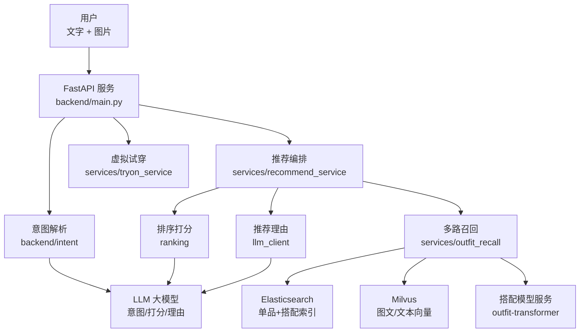
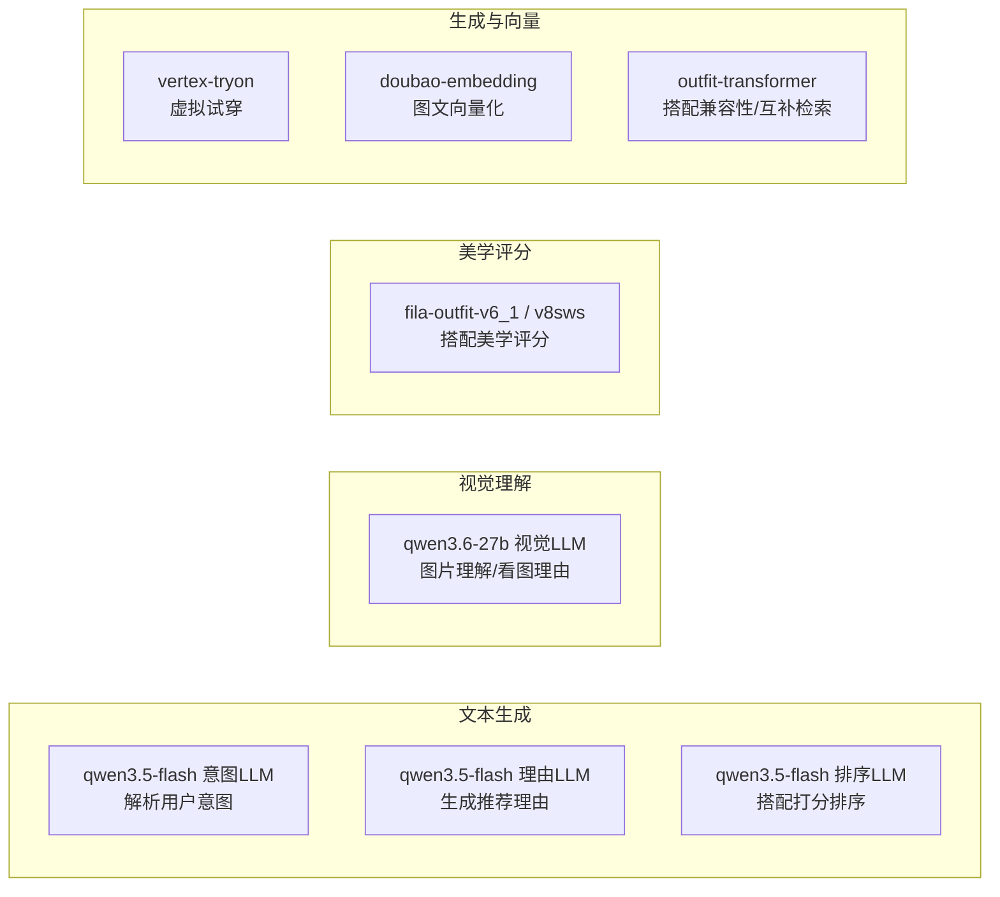

# FILA 穿搭推荐系统 · 技术架构文档

> **读者对象**：零 Python 基础的开发工程师（下一版本开发人员）
> **文档目的**：让你能**看懂代码结构、理解数据怎么流转、知道改哪里能实现什么功能**，并最终**动手开发下一版本**
> **阅读建议**：先读第 1~3 章建立整体认知，再按需精读第 4~8 章。开发前必读第 9 章《动手开发指南》

---

## 目录

1. [系统总体架构](#1-系统总体架构)
2. [技术栈清单](#2-技术栈清单)（含大模型清单与分工）
3. [代码目录结构](#3-代码目录结构)
4. [核心数据模型](#4-核心数据模型)
5. [请求处理全流程（代码级）](#5-请求处理全流程代码级)
6. [核心模块详解](#6-核心模块详解)
7. [数据存储与索引](#7-数据存储与索引)
8. [配置管理](#8-配置管理)
9. [动手开发指南](#9-动手开发指南)
10. [部署与运维](#10-部署与运维)
11. [常见问题排查](#11-常见问题排查)

---

## 1. 系统总体架构

### 1.1 架构图



### 1.2 一次请求的旅程（30 秒看懂）

```
用户输入 "这件浅灰 T 恤怎么搭？" + 图片
  ↓
① FastAPI 收到请求（backend/main.py 的路由）
  ↓
② 推荐服务编排（services/recommend_service.py 的 chat_stream）
  ↓
③ 意图解析：理解性别/季节/角色等（backend/intent + LLM）
  ↓
④ 确定锚点：以哪件衣服为核心
  ↓
⑤ 多路召回：从 ES + Milvus + 搭配库找候选搭配（services/outfit_recall）
  ↓
⑥ 合并去重 → 粗排（规则打分）→ 精排（可选 AI 打分）
  ↓
⑦ 生成推荐理由（LLM）
  ↓
⑧ （可选）虚拟试穿生成效果图
  ↓
⑨ 通过 SSE 流式返回搭配卡片
```

### 1.3 关键设计决策（为什么这么设计）

| 决策 | 原因 |
|------|------|
| 用 FastAPI + 异步 | 高并发、支持 SSE 流式输出 |
| 推荐结果来自固定搭配或拼套 | 保证货号真实存在，不凭空造货 |
| ES 管属性/文本检索，Milvus 管向量检索 | 各司其职，性能最优 |
| 多路召回 + 合并去重 | 提高召回率，避免单路漏掉好搭配 |
| 规则打分 + 可选 AI 打分 | 规则快且稳，AI 更准但慢，可灰度切换 |
| 配置全部在 config.yaml | 改配置不改代码即可调整行为 |

---

## 2. 技术栈清单

### 2.1 后端框架

| 技术 | 版本 | 用途 |
|------|------|------|
| Python | 3.12 | 主语言 |
| FastAPI | ≥0.110 | Web 框架（路由、参数校验、SSE） |
| Uvicorn | ≥0.27 | ASGI 服务器（跑 FastAPI） |
| Pydantic | ≥2.6 | 数据模型与请求校验 |
| httpx | ≥0.27 | HTTP 客户端（调 LLM、抓图） |

### 2.2 数据存储

| 技术 | 版本 | 用途 |
|------|------|------|
| Elasticsearch | 7.9.3 | 单品/搭配属性检索 |
| Milvus | 2.6.13 | 向量检索（图文/文本/互补） |
| Milvus Lite | 2.5.1 | 本地开发用向量库 |
| SQLite | - | 评测打分存储 |

### 2.3 AI 相关（大模型清单与分工）

> 本项目共使用 **6 类模型**，分别负责不同的任务。下表是完整清单，开发时按此表找到对应模型与代码位置。

#### 2.3.1 在线推荐链路（backend/ 运行时）

| 模型 | 配置区块 | 负责任务 | 代码位置 |
|------|---------|---------|---------|
| **qwen3.5-flash**（意图LLM） | `models.intent_llm` | **意图解析 fallback**：Trie 词典没把握时，从用户文字提取性别/季节/角色等槽位 | `llm_client.py` → `_chat_block("intent_llm")` |
| **qwen3.6-27b**（视觉LLM） | `models.vision_llm` | **图片理解**：分析上传图片提取颜色/风格/角色；`partner_vision` 模式下看单品图生成推荐理由 | `llm_client.py`、`ranking/vision_reasoner.py` |
| **qwen3.5-flash**（理由LLM） | `models.reason_llm` | **生成推荐理由**：搭配级/单品级话术（outfit_only / per_item / both） | `llm_client.py` → `_chat_block("reason_llm")` |
| **qwen3.5-flash**（排序LLM） | `models.ranking_llm` | **LLM 排序打分**：对候选搭配批量/并行打分排序，与理由合并生成 | `ranking/outfit_ranker.py` |
| **vertex-tryon**（试穿LLM） | `models.tryon_llm` | **虚拟试穿**：提交异步试穿任务生成穿搭效果图（提交+轮询） | `services/tryon_service.py` |

> **容灾说明**：意图/理由/排序 LLM 均配置了 `fallback_models`（如 `qwen3.7-plus`），主模型多次失败时自动切换。

#### 2.3.2 私有部署的美学评分模型（partner 模式，可选）

| 模型 | 配置 | 负责任务 | 代码位置 |
|------|------|---------|---------|
| **fila-outfit-v6_1** | `recommend.partner_rank_reason` | **多模态美学评分**：从美学角度给搭配打分（0-10 综合分）+ 生成评语作为推荐理由 | `ranking/partner_ranker.py`、`scripts/partner_call_example.py` |
| **fila-outfit-v8sws** | 同上（按模型名切换） | V8 版本：五维 CoT 评分 + 外部 f 覆写综合分 | `scripts/v8sws_client.py` |

> **切换方式**：`config.yaml` 的 `recommend.llm_rank_reason_method` 可配置为：
> - `ranking_llm`：qwen 文本模型打分（默认）
> - `partner`：私有美学模型打分 + 理由（合并）
> - `partner_qwen`：私有模型打分 + qwen3.5-flash 理由（两步并行）
> - `partner_vision`：私有模型打分 + qwen3.6-27b 看单品图理由（两步并行）

#### 2.3.3 向量化与搭配模型（非对话生成）

| 模型 | 配置 | 负责任务 | 代码位置 |
|------|------|---------|---------|
| **doubao-embedding-vision-251215** | `embedding` | **图文向量化**（1024 维）：图片/文本 → 向量，供 Milvus 向量检索 | `embedding_client.py` |
| **outfit-transformer**（Fashion-CLIP + Transformer） | 独立服务 | **搭配兼容性打分**（/score）+ **互补单品检索**（/embed_query、/embed_items，128 维） | `model/outfit-transformer/` |

#### 2.3.4 离线脚本中复用的 VLM

| 任务 | 使用的模型 | 脚本 |
|------|-----------|------|
| 商品图预处理（选 tryon_image） | qwen3.6-27b（vision_llm） | `scripts/fila_images_preprocess.py` |
| 提取商品长度类型 | qwen3.6-27b（vision_llm） | `scripts/extract_length_class_vlm.py` |
| 提取商品颜色 | qwen3.6-27b（vision_llm） | `scripts/fila_outfit_color_extract.py` |
| 评测打分 | qwen3.5-flash（eval_llm） | `eval/` |

#### 2.3.5 调试台可选模型（非默认）

调试台 UI 可手动切换：`qwen3.5-flash`、`qwen3.6-flash`、`qwen3.6-plus`、`qwen3.7-plus`、`claude-sonnet-4-6`、`google/gemini-3.1-pro-preview`（见 `recall_paths_config.py`）。

#### 2.3.6 模型分工一览（速查）



### 2.4 其他

| 技术 | 用途 |
|------|------|
| jieba | 中文分词（混合检索） |
| pyahocorasick | Trie 词典匹配（意图解析） |
| polars | 数据处理（ETL） |
| Docker / K8s | 部署 |

---

## 3. 代码目录结构

```
fila_agent_html/
├── backend/                  # ★ 核心后端代码（在线服务）
│   ├── main.py               # FastAPI 入口：路由、中间件、异常处理
│   ├── config.py             # 配置加载（config.yaml + 环境变量）
│   ├── models.py             # 数据模型（请求/响应/意图）
│   ├── auth.py               # API Key 鉴权 + 限流
│   ├── llm_client.py         # 大模型调用封装
│   ├── embedding_client.py   # 向量生成封装
│   ├── query_understanding.py# 文本意图解析入口
│   ├── prompt_loader.py      # Prompt 模板加载
│   ├── services/             # ★ 业务服务层（核心逻辑）
│   │   ├── recommend_service.py  # 推荐总编排（最重要）
│   │   ├── outfit_recall.py      # 多路召回 + 合并去重
│   │   ├── card_builder.py       # 搭配卡片组装
│   │   ├── tryon_service.py      # 虚拟试穿
│   │   ├── complementary_recall.py # 互补召回
│   │   ├── external_recommend.py # 对外接口整形
│   │   └── ...
│   ├── retrieval/           # 检索层
│   │   ├── es_client.py     # ES 客户端
│   │   ├── milvus_client.py # Milvus 客户端
│   │   ├── sku_retriever.py # 单品检索
│   │   ├── hybrid_search.py # 混合检索（BM25+向量）
│   │   └── ...
│   ├── intent/              # 意图解析
│   │   ├── intent_engine.py # 意图引擎主入口
│   │   ├── slot_defs.py     # 槽位定义
│   │   ├── trie_extractor.py# Trie 词典提取
│   │   └── ...
│   └── ranking/             # 排序打分
│       ├── scoring.py       # 打分函数
│       ├── outfit_ranker.py # 搭配排序
│       └── ...
├── config.yaml              # ★ 主配置（改配置调行为）
├── config/                  # 密钥等（不入 Git）
├── prompt/                  # LLM 提示词模板
├── web/                     # 调试台前端
├── outfits-viewer/          # 搭配预览前端
├── image-debug-viewer/      # 图片 Debug 前端
├── eval/                    # 批量评测
├── scripts/                 # ★ 离线 ETL 与索引脚本
├── tests/                   # 单元测试
├── docs/                    # 文档
├── Dockerfile               # 容器镜像
├── deployment*.yaml         # K8s 部署配置
└── requirements.txt         # Python 依赖清单
```

### 3.1 记住这三条主线

1. **在线推荐主线**：`main.py`（入口）→ `services/recommend_service.py`（编排）→ `services/outfit_recall.py`（召回）→ `ranking/`（排序）→ `llm_client.py`（理由）
2. **数据主线**：Hive CSV → `scripts/`（ETL）→ ES/Milvus 索引 → 在线服务读取
3. **配置主线**：`config.yaml` 控制一切开关、阈值、模型、路径

---

## 4. 核心数据模型

> 所有请求/响应/意图都用 Pydantic 模型定义，在 `backend/models.py`。字段名就是接口字段名。

### 4.1 用户意图（UserIntent）

系统把用户需求解析成这个结构（对应产品文档 5.1 的槽位）：

| 字段 | 类型 | 说明 |
|------|------|------|
| query_type | enum | item_to_outfit / outfit_reference / text_only |
| text | str | 用户原文 |
| gender | str | 性别（男/女/男童/女童/儿童） |
| age | str | 童装年龄段 |
| season | list | 季节（春/夏/秋/冬） |
| anchor_role | str | 锚点角色 |
| target_roles | list | 目标搭配角色 |
| occasion_tags | list | 场合标签 |
| style_tags | list | 风格标签 |
| color / color_series | list | 颜色 / 色系 |
| category | list | 品类 |
| length_class | str | 长度类型 |
| modeling | str | 版型 |
| budget_max / budget_min | float | 预算区间 |
| series | str | 子品牌线 |
| target_slots | dict | 每个角色的正向/负向槽位覆盖 |

### 4.2 对话请求（ChatRequest）

| 字段 | 说明 |
|------|------|
| session_id | 会话号（多轮对话用） |
| message | 用户文字 |
| image_base64 | 用户图片（Base64） |
| selected_sku_id / selected_spu_id | 用户显式选择的货号/款号 |
| ranking_scoring_method | 排序方式（rule/llm） |
| enable_llm_rank_reason | 是否开启 AI 排序+理由 |
| enable_tryon | 是否开启试穿 |

### 4.3 搭配卡片（outfit card）

返回的每套搭配结构（详见产品文档 4.2），代码在 `services/card_builder.py` 组装。

### 4.4 关键枚举

| 枚举 | 值 | 说明 |
|------|-----|------|
| 性别标准值 | 男/女/男童/女童/儿童 | 各种别名会归一化到这里 |
| 季节标准值 | 春/夏/秋/冬 | Q1~Q4、FW/SS 等会归一化 |
| 召回通路 | image_vector/query2es/text_vector/complementary_model | 4 条召回通路 |
| 搭配来源 | cc_material/micro_guide/dphs_outfits/outfits_unique | 运营固定搭配来源 |

---

## 5. 请求处理全流程（代码级）

### 5.1 入口：backend/main.py

`main.py` 做的事：
1. 初始化日志、加载配置、校验 Prompt 路径
2. 定义路由（`/chat`、`/recommend/skus`、`/v1/outfit/recommend` 等）
3. 挂载静态页面（web、outfits-viewer 等）
4. 中间件：trace_id 生成、API Key 鉴权、调试日志
5. 异常处理：统一错误格式 `{"code", "message", "trace_id"}`

### 5.2 核心：services/recommend_service.py 的 chat_stream

这是**整个系统的核心函数**，一次对话推荐的完整流程：

```python
async def chat_stream(self, req: ChatRequest):
    # ① 生成 trace_id，记录开始
    # ② 图片向量化（后台线程）+ 读取 SKU 信息（并发）
    # ③ 图向量近邻召回（意图解析用）
    # ④ 意图解析（Trie + 图搜 + LLM 融合）
    # ⑤ 确定锚点（显式 SKU > 图搜 Top1 > 文本货号）
    # ⑥ 多路召回（4 条通路并行）
    # ⑦ 合并去重
    # ⑧ 粗排（规则打分截断）
    # ⑨ 精排 + 生成推荐理由（可选 AI）
    # ⑩ （可选）虚拟试穿
    # ⑪ 组装搭配卡片，SSE 流式返回
```

**每一步都会 `yield` 一个 SSE 事件**，前端实时展示进度。

### 5.3 对外接口：external_recommend

对外接口（`/v1/outfit/recommend`）复用 `chat_stream` 的底层逻辑，只做两件事：
1. **入参映射**：把外部参数（app_id、image_url、input_sku_id）转成内部格式
2. **出参整形**：把搭配卡片转成对外契约格式（含 id_goods、sku_image_url 等）

---

## 6. 核心模块详解

### 6.1 意图解析（backend/intent + query_understanding.py）

**入口**：`parse_user_intent()` → `extract_intent()`

**三路融合逻辑**（对应产品文档 5.1）：
1. **Trie 词典**：`trie_extractor.py` 用预置词典快速提取槽位
2. **图片理解**：图向量近邻 → 相似商品属性反推槽位（高相似度覆盖）
3. **LLM fallback**：词典没把握时调大模型提取

**关键规则**：
- 用户**明确说**的槽位（`_is_explicit_mention`）优先级最高，不可被覆盖
- 高相似度图片（≥0.9）可覆盖性别/季节/角色
- 季节缺省时按当前日期推断（3~5月春、6~8月夏…）

**改这里能做什么**：想让系统更懂某类话术 → 加词典词或改 prompt。

### 6.2 多路召回（services/outfit_recall.py）

**入口**：`multi_path_recall()`

4 条通路（对应产品文档 5.3）：
1. **image_vector**：锚点图向量 → Milvus 近邻 SKU → 查固定搭配库
2. **query2es**：意图 → ES 按角色检索单品 → 拼套
3. **text_vector**：语义向量 → Milvus 近邻 SKU → 拼套
4. **complementary_model**：搭配模型 → 互补单品 → 拼套

**合并去重**：`merge_and_dedupe_outfits()` 按"单品集合相同"去重，保留最优。

**搭配规则过滤**：中类规则、色系规则、场景域过滤、上架时间过滤。

**改这里能做什么**：想加一条新的召回通路 → 在这里加；想调整搭配规则 → 改规则字典。

### 6.3 排序打分（ranking/）

**粗排**：`coarse_rank_outfits()` → `scoring.py` 的规则打分（8 个分项加权求和）

**精排**：`rank_deduped_outfits()` → 可选 LLM 打分

**打分函数**（scoring.py）：
- `outfit_completeness_score()`：完整度（上装+下装+鞋=1.0）
- `intent_attr_match()`：意图匹配
- `price_match()`：预算匹配
- `gender_conflict()` / `season_conflict()` / `age_conflict()`：冲突判断

**改这里能做什么**：想调整推荐排序 → 改权重或打分函数。

### 6.4 推荐理由（llm_client.py）

- `generate_outfit_reason_payload()`：LLM 生成推荐理由
- 理由模式：outfit_only（只搭配合）/ per_item（每件单品）/ both
- Prompt 在 `prompt/reason_*.md`

**改这里能做什么**：想让理由更生动/更专业 → 改 prompt 模板。

### 6.5 虚拟试穿（services/tryon_service.py）

- `batch_tryon_outfits()`：批量生成试穿图
- 按性别选模特图，拼接上装/下装/鞋的试穿图
- 默认关闭，`config.yaml` 的 `recommend.tryon.enabled` 控制

### 6.6 鉴权与限流（auth.py）

- `ApiKeyStore`：API Key 白名单（热加载 api_keys.yaml）
- `RateLimiter`：进程内 QPM + 日调用量 + 并发排队
- 保护路径：`/v1/outfit/recommend`、`/v1/outfit/regenerate-reason`、`/api/outfits`、`/skus/*`

### 6.7 检索客户端（retrieval/）

- **es_client.py**：ES 查询封装（单品检索、搭配检索、批量 upsert）
- **milvus_client.py**：Milvus 向量检索（支持 hybrid：BM25 + dense）
- **hybrid_search.py**：混合检索（关键词 + 语义）
- **sku_retriever.py**：单品检索（按向量、按属性、按款号展开）

---

## 7. 数据存储与索引

### 7.1 Elasticsearch 索引

| 索引 | 用途 | 主要字段 |
|------|------|---------|
| fila-skus | 单品索引 | sku_id、role、category_l2、color_series、gender、season、price、search_text、图片 URL |
| fila-outfits | 搭配索引 | outfit_id、items、source、图片 |
| fila-reviews | 评测意见 | 评测打分 |
| fila-requests | 请求审计 | 输入/意图/召回/结果 |

### 7.2 Milvus 集合

| 集合 | 用途 | 向量维度 |
|------|------|---------|
| fila_sku_vectors | SKU 图文向量 | 1024 |
| fila_sku_text_vectors | SKU 文本向量（支持 BM25+dense hybrid） | 1024 |
| fila_sku_complementary_vectors | 互补单品向量 | 128 |
| fila_sku_hybrid_vectors | 混合向量 | - |

### 7.3 本地文件

| 目录 | 说明 |
|------|------|
| data/tables/ | Hive 日更商品原始表 CSV |
| data/processed/ | 离线 ETL 产出（skus.jsonl、spu_to_skus.json） |
| data/preview/ | 固定搭配预览 JSON |
| data/logs/ | 日志、索引同步状态、会话回放 |

### 7.4 数据流向（离线 ETL）

```text
data/tables/*.csv（Hive 日更）
  → build_catalog.py → skus.jsonl + spu_to_skus.json
  → select_images.py → 回写图片字段
  → build_fila_guide_outfits_fast.py → fila_outfits.json
  → validate_data.py → 数据校验
  → build_fila_es_index.py → ES 单品+搭配索引
  → build_fila_milvus_multimodal_index.py → Milvus 图文向量
  → build_text_milvus_index.py → Milvus 文本向量
  → 在线服务读取
```

---

## 8. 配置管理

### 8.1 config.yaml 核心区块

| 区块 | 说明 | 关键项 |
|------|------|--------|
| ui_mode | 前端模式 | debug / presentation |
| auth | 鉴权与限流 | enabled、rate_limit |
| paths | 数据路径 | product_dir、processed_dir |
| intent | 意图解析 | method（llm/trie）、confidence_threshold |
| models.* | 各阶段 LLM | base_url、model、api_key_env |
| embedding | 向量模型 | provider、model、dimensions |
| elasticsearch | ES 配置 | hosts、indices |
| milvus | 向量库 | mode（local/cloud）、collections |
| recommend | 推荐开关 | recall_paths、排序、试穿、规则 |

### 8.2 环境变量（优先级高于 config.yaml）

| 变量 | 用途 |
|------|------|
| ANTA_LLM_API_KEY | 大模型密钥 |
| ARK_API_KEY | Embedding 密钥 |
| ES_HOSTS / ES_USERNAME / ES_PASSWORD | ES 连接 |
| FILA_MILVUS_MODE / URI / TOKEN / PASSWORD | Milvus 连接 |
| HIVE_USERNAME / HIVE_PASSWORD | Hive 数据下载 |

### 8.3 改配置 vs 改代码

| 想实现 | 改哪里 |
|--------|--------|
| 开关某条召回通路 | config.yaml → recommend.recall_paths |
| 调整排序权重 | config.yaml → recommend.outfit_rank_weights |
| 切换排序方式 | config.yaml → recommend.ranking_scoring_method |
| 调整召回/返回数量 | config.yaml → recommend.recall_outfit_limit / rank_outfit_limit |
| 改推荐理由风格 | prompt/reason_*.md |
| 改意图理解能力 | prompt/intent_extract.md + 词典 |
| 加新功能/新逻辑 | 改代码 |

---

## 9. 动手开发指南

> 这一章是给你"上手干活"的。零基础也能照着做。

### 9.1 本地环境搭建（第一次）

```bash
# 1. 进入项目目录
cd fila_agent_html

# 2. 创建虚拟环境（隔离依赖）
python3 -m venv .venv
source .venv/bin/activate   # Windows 用: .venv\Scripts\activate

# 3. 安装依赖
pip3 install -r requirements.txt -i https://mirrors.aliyun.com/pypi/simple/

# 4. 设置环境变量（密钥）
export PYTHONPATH="$(pwd)"
export ANTA_LLM_API_KEY="你的密钥"
export ARK_API_KEY="你的密钥"
# ...其他密钥按需设置

# 5. 启动服务
uvicorn backend.main:app --host 0.0.0.0 --port 8000
```

启动后访问：
- 调试台：http://127.0.0.1:8000/
- 搭配预览：http://127.0.0.1:8000/outfits-viewer/
- 健康检查：http://127.0.0.1:8000/health

### 9.2 推荐链路代码地图（改哪里实现什么）

| 你想改的功能 | 去哪个文件 | 看哪个函数 |
|------------|-----------|-----------|
| 推荐流程整体 | services/recommend_service.py | chat_stream |
| 召回逻辑 | services/outfit_recall.py | multi_path_recall |
| 排序打分 | ranking/scoring.py | 各打分函数 |
| 排序权重 | config.yaml | outfit_rank_weights |
| 意图解析 | backend/intent/ | extract_intent |
| 推荐理由 | llm_client.py + prompt/ | generate_outfit_reason_payload |
| 对外接口 | services/external_recommend.py | external_recommend |
| 卡片组装 | services/card_builder.py | outfit_card |
| 鉴权限流 | auth.py | verify_api_key |

### 9.3 动手改一个功能的完整流程（示例）

**目标**：把默认返回搭配数从 6 套改成 8 套。

1. 打开 `config.yaml`
2. 找到 `recommend` 区块下的 `rank_outfit_limit: 6`
3. 改成 `rank_outfit_limit: 8`
4. 保存，重启服务（`uvicorn backend.main:app ...`）
5. 在调试台验证返回 8 套

**结论**：很多"调行为"的需求，改配置就行，不用动代码。

### 9.4 动手改代码的步骤规范

1. **先读懂再改**：用上面的"代码地图"定位到函数，读完整函数再动手
2. **小步修改**：一次只改一个功能点，改完立即验证
3. **跑测试**：改完跑相关单元测试
   ```bash
   python -m pytest tests/test_xxx.py -v
   ```
4. **验证**：在调试台手动验证 + 跑批量评测
5. **写注释**：说明为什么这么改

### 9.5 新增一个功能的思路

**示例：新增"按价格区间过滤"功能**

1. **数据层**：确认 SKU 数据有价格字段（有，price）
2. **意图层**：确认 UserIntent 有 budget_max/budget_min（有）
3. **召回层**：在召回时应用价格过滤（参考现有 gender/season 过滤写法）
4. **排序层**：确认 price_match 打分（有）
5. **接口层**：确认请求模型支持传价格（有）
6. **测试**：写测试用例验证

**核心思路**：跟着"意图 → 召回 → 排序 → 接口"这条链路走，每一层都确认数据是否流到、过滤是否生效。

### 9.6 常见开发任务速查

| 任务 | 做法 |
|------|------|
| 加一个词典词 | 编辑 intent 词典文件 |
| 调整推荐理由话术 | 编辑 prompt/reason_*.md |
| 加一条召回通路 | 在 outfit_recall.py 的 multi_path_recall 加一路 |
| 调整排序权重 | 改 config.yaml 的 outfit_rank_weights |
| 新增对外字段 | 改 models.py + card_builder.py + external_recommend.py |
| 修一个 bug | 先用 trace_id 定位日志，再改对应函数 |

---

## 10. 部署与运维

### 10.1 Docker 部署

```bash
# 构建镜像
docker build -t fila-outfit .

# 运行
docker run -p 8080:8080 \
  -e ANTA_LLM_API_KEY=xxx \
  -e ARK_API_KEY=xxx \
  -e ES_USERNAME=xxx -e ES_PASSWORD=xxx \
  fila-outfit
```

### 10.2 K8s 部署

`deployment.yaml` 定义了：
- 镜像、副本数、环境变量
- 健康检查（startup/liveness/readiness 探针）
- 资源限制

```bash
kubectl apply -f deployment.yaml
```

### 10.3 运维要点

- **健康检查**：`GET /health` 返回 `{"status":"ok"}`
- **日志**：`data/logs/` 下 JSONL 格式，含每阶段耗时
- **trace_id**：每个请求唯一，凭它定位问题
- **配置热改**：改 config.yaml 后重启服务生效

---

## 11. 常见问题排查

| 问题 | 排查方法 |
|------|---------|
| 返回空搭配 | 检查召回通路是否开启、数据是否最新、是否有锚点 |
| 推荐结果不合理 | 检查意图解析是否正确、搭配规则是否过严 |
| LLM 报错 | 检查 ANTA_LLM_API_KEY、模型配置、prompt 路径 |
| ES 连不上 | 检查 ES_HOSTS/USERNAME/PASSWORD、索引是否存在 |
| Milvus 连不上 | 检查 FILA_MILVUS_MODE/URI/TOKEN |
| 试穿失败 | 检查 tryon.enabled、模特图 URL、tryon_image 是否齐全 |
| 请求被限流 | 检查 auth.rate_limit 配置、API Key 是否有效 |

---

> **下一步建议**：先用第 9.1 节把服务跑起来，在调试台体验一次完整推荐，然后对照第 9.2 节的"代码地图"阅读对应代码。有任何不懂的地方，沿着"意图 → 召回 → 排序 → 接口"这条链路逐个模块理解即可。
