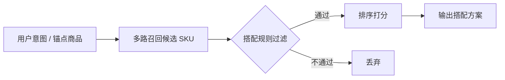

# FILA 穿搭推荐 — 检索规则现状与业务输入需求

> 文档目的：向业务同学说明当前推荐系统在**检索阶段**使用了哪些搭配过滤规则、这些规则的来源与局限，并明确需要业务提供的专业规则输出格式。
>
> 更新时间：2026-07-01

---

## 一、背景：推荐系统如何工作（业务视角）

当用户发起「帮我搭配」或选中一件商品作为锚点时，系统会：

1. **多路召回**：从商品库中分别召回上装、下装、鞋、配饰等候选 SKU；
2. **规则过滤**：在召回阶段用搭配规则筛掉明显不合理的组合；
3. **排序打分**：对剩余候选按相关性、风格、价格等维度排序，输出最终搭配方案。

本文聚焦第 2 步——**检索阶段的搭配过滤规则**。规则质量直接决定「会不会推出不搭的商品」，是业务专业经验最需要介入的环节。



当前启用的三类搭配规则：

| 规则类型 | 作用 | 当前数据来源 | 是否需业务补充 |
|---------|------|-------------|--------------|
| **中类搭配** | 锚点中类 → 允许召回哪些中类 | 历史固定搭配数据统计 | **是，核心需求** |
| **色系搭配** | 锚点色系 → 允许召回哪些色系 | 历史固定搭配数据统计 | **是，核心需求** |
| **场景搭配** | 锚点场景 → 允许召回哪些场景 | 工程侧初步配置 | **是，建议确认** |

此外还有少量**硬性冲突规则**（如连衣裙不能再配上装、长袖×短裤季节冲突），由工程侧维护，本文附录简要列出。

---

## 二、检索现状说明

### 2.1 中类（category_l2）搭配规则

#### 什么是「中类」

中类是商品二级类目，例如：`短袖T恤`、`梭织长裤`、`老爹鞋`、`半身裙`。系统共有 **54 个中类**。

#### 当前规则怎么来的

从约 **4 万条**历史固定搭配数据中，统计「当锚点商品是 A 中类时，搭配里还出现了哪些 B 中类」，按出现频率生成搭配白名单：

- **首选搭配（primary）**：共现频率 ≥ 8%，搭配最常见；
- **允许搭配（allowed）**：共现频率 ≥ 2%，搭配偶尔出现。

检索时默认使用**首选搭配**（更严格）；样本量不足时自动放宽到允许搭配，或不做中类过滤。

#### 当前规则示例

以用户选中「短袖T恤」为锚点为例：

| 字段 | 当前系统值 |
|------|-----------|
| 首选搭配中类 | 包、半身裙、帽子、梭织长裤、老爹鞋 |
| 允许搭配中类 | 休闲鞋、凉鞋、包、半身裙、帆布鞋、帽子、户外鞋、板鞋、梭织五分裤、梭织短裤、梭织长裤、老爹鞋、针织长裤 |

即：系统只会从上述中类里召回候选商品，其他中类（如滑雪裤、单层冲锋衣）会被过滤掉。

#### 已知问题（需业务判断）

| 问题 | 举例 | 业务影响 |
|------|------|---------|
| **统计≠专业** | 历史搭配里「短袖T恤 + 滑雪裤」若出现过，可能被纳入 allowed | 推出季节/场景不搭的组合 |
| **样本稀疏** | 部分中类（如儿童鞋、拖鞋、潮鞋）历史搭配极少，规则为空 | 该类商品搭配时几乎不做中类过滤 |
| **无法表达互斥** | 规则只描述「可搭」，不描述「绝对不搭」 | 连衣裙 + 上装等冲突需靠其他规则兜底 |
| **无优先级** | 首选和允许是频率阈值，不是业务优先级 | 常见但不好看的组合可能排前面 |

> 完整当前规则见附件思路：工程侧文件 `category_l2_pairing.yaml`（由历史搭配自动统计生成）。

---

### 2.2 色系（color_series）搭配规则

#### 什么是「色系」

系统将商品颜色归并为 **11 个基础色系**（另加「多色系」用于印花/拼色款）：

`黑色系` `白色系` `灰色系` `红色系` `粉色系` `橙色系` `黄色系` `绿色系` `蓝色系` `紫色系` `棕色系` `多色系`

#### 当前规则怎么来的

同样从历史固定搭配统计：当锚点商品是「黑色系」时，搭配里其他商品最常出现哪些色系。

- **首选色系（primary_companions）**：共现率 ≥ 8%
- **允许色系（allowed_companions）**：共现率 ≥ 2%

#### 当前规则示例

以锚点「黑色系」为例：

| 字段 | 当前系统值 |
|------|-----------|
| 首选色系 | 棕色系、灰色系、白色系、粉色系、红色系、绿色系、蓝色系、黄色系 |
| 允许色系 | 多色系、棕色系、灰色系、白色系、粉色系、紫色系、红色系、绿色系、蓝色系、黄色系 |

实际效果：黑色系锚点几乎可以和所有色系搭配（因为黑白灰是百搭色，统计上共现率都很高）。

#### 已知问题（需业务判断）

| 问题 | 举例 | 业务影响 |
|------|------|---------|
| **百搭色稀释规则** | 白色/黑色/灰色与几乎所有色共现率高 | 过滤效果弱，几乎等于不过滤 |
| **缺少撞色/禁忌色** | 系统有工程侧「撞色」映射，但未经业务确认 | 撞色系推荐可能不符合 FILA 调性 |
| **多色系处理粗糙** | 印花款归为「多色系」，搭配范围很宽 | 花款搭配缺乏专业约束 |
| **无季节/场景维度** | 同一色系规则全年通用 | 秋冬配色与春夏配色未区分 |

> 完整当前规则见工程侧文件 `color_series_pairing.yaml`。

---

### 2.3 场景（scene_domain）搭配规则

#### 什么是「场景域」

系统将商品按穿着场景分为以下域（专业运动服 vs 日常休闲服）：

| 场景域代码 | 含义 | 示例商品 |
|-----------|------|---------|
| `daily` | 日常休闲 | 短袖T恤、休闲鞋、梭织长裤 |
| `gym` | 健身 | 运动文胸、针织打底裤 |
| `tennis` | 网球 | 网球裙、网球鞋 |
| `golf` | 高尔夫 | 高尔夫POLO、高尔夫鞋 |
| `running` | 跑步 | 跑鞋、跑步短裤 |
| `outdoor` | 户外 | 冲锋衣、户外鞋 |
| `ski` | 滑雪 | 滑雪服、滑雪裤 |
| `swim` | 游泳 | 泳装 |
| `cycling` | 骑行 | 骑行服 |
| `basketball` | 篮球 | 篮球鞋、篮球短裤 |
| `""`（空） | 中性/跨场景 | 帽子、包、休闲鞋、板鞋 |

#### 当前规则

规则表达为：**锚点场景 → 可搭配的候选场景列表**（有向，非对称）。

| 锚点场景 | 当前允许搭配的候选场景 |
|---------|----------------------|
| daily（日常） | daily |
| gym（健身） | gym, daily |
| tennis（网球） | tennis |
| golf（高尔夫） | golf |
| running（跑步） | running |
| outdoor（户外） | outdoor |
| ski（滑雪） | ski |
| swim（游泳） | swim |
| cycling（骑行） | cycling |
| basketball（篮球） | basketball, daily, tennis, golf |

含义举例：

- 用户选了一件**网球服**（tennis），系统只会召回网球类或中性类配件，不会推滑雪裤、泳装；
- 用户选了一件**健身服**（gym），可以搭配健身类或日常类，但不能搭配网球/高尔夫等专业类；
- **帽子、包**等中性配件不受场景限制，任何场景均可搭配。

#### 已知问题（需业务判断）

| 问题 | 需业务确认 |
|------|-----------|
| gym 允许搭 daily 是否合理？ | 健身后穿日常卫衣是否算合理搭配？ |
| basketball 允许搭 tennis/golf 是否过宽？ | 篮球鞋能否搭网球裙/高尔夫裤？ |
| outdoor 是否应允许搭 daily？ | 户外冲锋衣配日常休闲裤是否 OK？ |
| 新场景是否遗漏？ | 如「校园」「通勤」「度假」等 FILA 主力场景 |

---

### 2.4 其他硬性冲突规则（工程侧维护，供业务知晓）

以下规则不依赖统计，由工程侧根据常识配置，业务如有补充可一并反馈：

| 规则 | 说明 |
|------|------|
| 连衣裙 × 上装/下装 | 连衣裙是完整着装，不能再配上装或下装 |
| 两件全身装互斥 | 如连衣裙 × 连衣裙 |
| 长袖上装 × 短款下装（男） | 季节感冲突，如长袖卫衣 + 短裤 |
| 同层叠穿冲突 | 两件内搭或两件外套不应搭配 |

---

## 三、需要业务提供的输出

请业务同学以**专业搭配经验**为准，按以下格式提供规则。格式刻意简化，便于填写和工程导入。

### 3.1 中类搭配规则（必填）

**格式**：每个锚点中类，列出可搭配的互补中类。

```yaml
# 中类搭配规则（业务版）
# 填写说明：
#   - 锚点中类：用户选中的商品中类
#   - 可搭配中类：推荐系统允许召回的互补中类（不需要区分首选/允许，统一列一份即可）
#   - 不可搭配中类（可选）：明确禁止的组合，用于补充系统互斥规则
#   - 备注（可选）：说明搭配场景或注意事项

中类搭配:
  短袖T恤:
    可搭配: [梭织长裤, 梭织短裤, 针织长裤, 半身裙, 老爹鞋, 板鞋, 休闲鞋, 帽子, 包]
    不可搭配: [滑雪裤, 滑雪服, 单层冲锋衣]   # 可选
    备注: 夏季日常休闲为主

  连衣裙:
    可搭配: [休闲鞋, 板鞋, 老爹鞋, 凉鞋, 帽子, 包]
    不可搭配: [短袖T恤, 梭织上衣, 针织上衣, 梭织长裤]  # 连衣裙不需搭配上/下装
    备注: 连衣裙为完整着装

  羽绒服:
    可搭配: [梭织长裤, 针织长裤, 针织上衣, 长袖T恤, 老爹鞋, 休闲鞋, 帽子]
    不可搭配: [梭织短裤, 针织短裤, 凉鞋, 拖鞋]
    备注: 秋冬外套，不配夏季下装和凉鞋

  # ... 请覆盖以下 54 个中类（至少覆盖销量 Top 30）
```

**中类完整清单（54 个）**：

```
休闲鞋, 儿童鞋, 凉鞋, 包, 半身裙, 单层冲锋衣, 套头卫衣, 帆布鞋, 帽子,
户外鞋, 拖鞋, 板鞋, 梭织七分裤, 梭织上衣, 梭织两件套, 梭织五分裤, 梭织短裤,
梭织长裤, 梭织马甲, 棉马甲, 滑雪服, 滑雪裤, 潮鞋, 短袖POLO, 短袖T恤,
短袖梭织上衣, 短袖编织衫, 短袖衬衫, 短袖针织上衣, 编织开衫, 编织衫, 网球包,
网球鞋, 羽绒服, 老爹鞋, 背心, 袜子, 跑鞋, 运动文胸, 运动鞋, 连帽卫衣,
连衣裙, 针织上衣, 针织五分裤, 针织打底裤, 针织短裤, 针织长裤, 针织马甲,
长羽绒服, 长袖POLO, 长袖T恤, 长袖衬衫, 防晒服, 高尔夫鞋
```

**填写建议**：

1. 优先填写**销量高、搭配需求大**的中类（如短袖T恤、梭织长裤、老爹鞋、羽绒服等）；
2. 「可搭配」只需列**互补角色**的中类（鞋配衣、上装配下装），同角色不必列；
3. 「不可搭配」用于明确否决，比「可搭配」更能提升推荐质量；
4. 若某中类暂时无法判断，标注「待确认」即可，不必强行填全。

---

### 3.2 色系搭配规则（必填）

**格式**：每个锚点色系，列出可搭配的互补色系。

```yaml
# 色系搭配规则（业务版）
# 填写说明：
#   - 锚点色系：用户选中商品或指定颜色的色系
#   - 可搭配色系：推荐系统允许召回的互补色系
#   - 不可搭配色系（可选）：明确禁忌，如「大面积红配绿」

色系搭配:
  黑色系:
    可搭配: [白色系, 灰色系, 红色系, 蓝色系, 粉色系, 棕色系]
    不可搭配: []  # 黑色百搭，无禁忌
    备注: 经典黑白灰永不过时

  红色系:
    可搭配: [黑色系, 白色系, 灰色系, 蓝色系, 棕色系]
    不可搭配: [绿色系, 紫色系]  # 大面积红绿/红紫需谨慎
    备注: 红色作点缀色更稳妥

  粉色系:
    可搭配: [白色系, 灰色系, 黑色系, 蓝色系]
    不可搭配: [红色系, 橙色系]
    备注: FILA 少女线常用粉+白/灰

  多色系:
    可搭配: [黑色系, 白色系, 灰色系]
    不可搭配: [多色系]
    备注: 花款上衣配纯色下装/鞋

  # ... 请覆盖全部 12 个色系
```

**色系完整清单（12 个）**：

```
黑色系, 白色系, 灰色系, 红色系, 粉色系, 橙色系,
黄色系, 绿色系, 蓝色系, 紫色系, 棕色系, 多色系
```

**填写建议**：

1. 重点明确**禁忌色组合**（不可搭配），比罗列可搭色系更有价值；
2. 可区分「全身主色」与「点缀色」策略（如「红色系主色只配黑/白/灰，红色作点缀可配更多色」）；
3. 如有 FILA 品牌专属配色规范（如品牌色、季节色盘），请一并附上参考文档。

---

### 3.3 场景搭配规则（建议确认）

**格式**：每个锚点场景，列出可搭配的候选场景。

```yaml
# 场景搭配规则（业务版）
# 填写说明：
#   - 规则有方向性：「网球 → [网球]」表示选网球服时只推网球类
#   - 中性配件（帽子、包、休闲鞋等）默认跨场景，无需列出

场景搭配:
  daily:    [daily]
  gym:      [gym, daily]           # 请确认 gym 能否搭 daily
  tennis:   [tennis]
  golf:     [golf]
  running:  [running]
  outdoor:  [outdoor, daily]       # 请确认 outdoor 能否搭 daily
  ski:      [ski]
  swim:     [swim]
  cycling:  [cycling]
  basketball: [basketball, daily]  # 请确认是否去掉 tennis/golf
```

**场景域完整清单（10 个）**：

```
daily, gym, tennis, golf, running, outdoor, ski, swim, cycling, basketball
```

---

### 3.4 可选补充：季节适宜性（数据质量相关）

除搭配规则外，商品数据存在**季节标注不准确**的问题（如长袖 SKU 标了夏季）。若业务有明确的「商品适宜穿着季节」标准或字段定义，请一并提供，用于改善季节冲突过滤。

---

## 四、业务输出汇总

| 交付物 | 格式 | 优先级 | 覆盖范围 |
|--------|------|--------|---------|
| 中类搭配规则 | YAML / Excel | **P0** | 至少 Top 30 中类，理想 54 个全覆盖 |
| 色系搭配规则 | YAML / Excel | **P0** | 12 个色系全覆盖 |
| 场景搭配规则 | YAML / Excel | **P1** | 确认或修订现有 10 个场景域 |
| 季节适宜性标准 | 文档 / 字段说明 | **P2** | 商品主数据规范 |

### Excel 模板（如偏好表格填写）

**Sheet 1：中类搭配**

| 锚点中类 | 可搭配中类（逗号分隔） | 不可搭配中类（逗号分隔） | 备注 |
|---------|----------------------|------------------------|------|
| 短袖T恤 | 梭织长裤,老爹鞋,半身裙 | 滑雪裤,滑雪服 | 夏季日常 |

**Sheet 2：色系搭配**

| 锚点色系 | 可搭配色系（逗号分隔） | 不可搭配色系（逗号分隔） | 备注 |
|---------|----------------------|------------------------|------|
| 黑色系 | 白色系,灰色系,红色系 | | 百搭 |

**Sheet 3：场景搭配**

| 锚点场景 | 可搭配场景（逗号分隔） | 备注 |
|---------|----------------------|------|
| tennis | tennis | 专业网球不跨场景 |

---

## 五、规则上线后的效果

业务规则提供后，工程侧将：

1. 替换当前「历史统计规则」为「业务专业规则」；
2. 在检索阶段按规则过滤候选 SKU，减少不合理搭配进入排序；
3. 保留置信度兜底：规则未覆盖的中类/色系，降级为仅按角色（上装/下装/鞋）过滤；
4. 支持业务规则热更新，无需改代码。

预期改善：

- 减少「季节冲突」（羽绒服 + 短裤）类推荐；
- 减少「场景冲突」（网球服 + 滑雪裤）类推荐；
- 减少「品类冲突」（连衣裙 + T恤）类推荐；
- 提升配色专业度，符合 FILA 品牌调性。

---

## 六、附录

### A. 当前系统配置参考

| 配置项 | 当前值 | 说明 |
|--------|--------|------|
| 中类规则数据源 | 历史搭配共现统计 | 待替换为业务规则 |
| 中类过滤严格度 | primary（首选） | 样本不足时自动放宽 |
| 色系规则数据源 | 历史搭配共现统计 | 待替换为业务规则 |
| 色系过滤严格度 | primary_companions | 样本不足时自动放宽 |
| 场景过滤 | 已启用 | 基于 scene_allow 表 |

### B. 相关工程文件（供技术同学参考）

- `backend/intent/dictionaries/category_l2_pairing.yaml` — 当前中类统计规则
- `backend/intent/dictionaries/color_series_pairing.yaml` — 当前色系统计规则
- `backend/intent/dictionaries/outfit_conflict_rules.yaml` — 场景规则 + 硬性冲突规则

### C. 联系方式

如有疑问，请联系算法/工程同学协助解读当前规则或确认填写格式。
